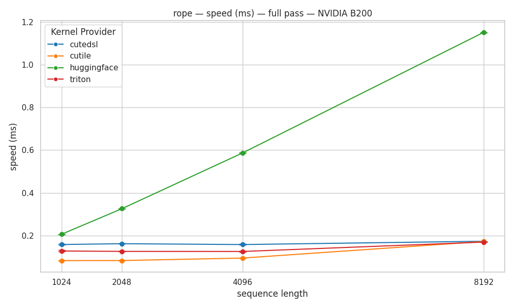
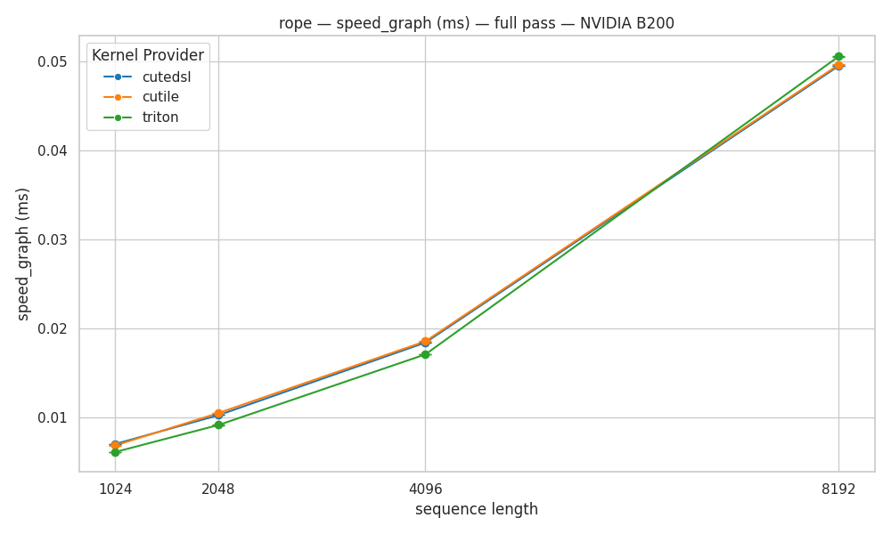
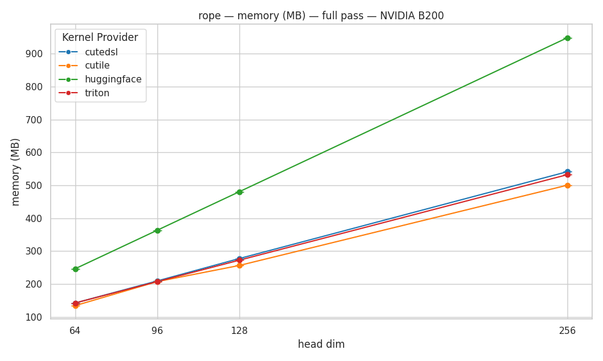
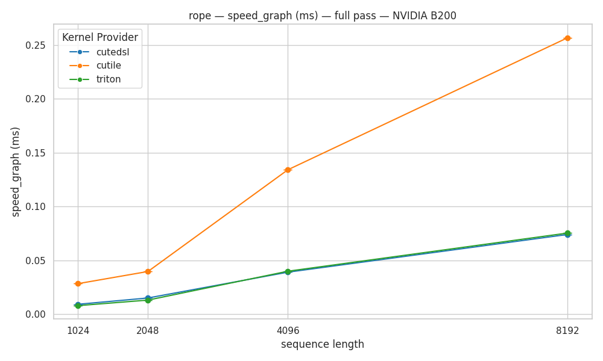

# Three Ways to Write One Kernel: Triton vs cuTile vs CuTe DSL for RoPE

*A head-to-head study of Liger-Kernel's three RoPE backends on an NVIDIA B200.*

Liger-Kernel ships **three** implementations of the same Rotary Positional
Embedding (RoPE) op:

| Backend | Language | Source |
|---|---|---|
| **Triton** | OpenAI Triton | `src/liger_kernel/ops/rope.py` |
| **cuTile** | NVIDIA cuTile (`cuda.tile`) | `src/liger_kernel/ops/cutile/ops/rope.py` |
| **CuTe DSL** | NVIDIA CUTLASS Python DSL (`cutlass.cute`) | `src/liger_kernel/ops/cutedsl/ops/rope.py` |

They compute exactly the same thing (the HF "rotate-half" RoPE). The interesting
question is: **do three different GPU DSLs, targeting the same memory-bound op,
actually behave the same?** The short answer is *"yes, until they don't"* — and
the place they stop being the same is a nice window into what each DSL can and
cannot express.

All numbers below are on a single **NVIDIA B200 (sm_100)**, bf16, measured with
`benchmark/scripts/benchmark_rope_backends.py` (runs all three backends +
HuggingFace in one process). Times are the **full forward+backward** pass unless
noted, in microseconds (µs), median.

---

## TL;DR

1. **All three Liger backends beat HuggingFace by ~7–15× in eager mode** and
   ~20–30× on device. RoPE is memory-bound; the Liger kernels fuse it into a
   single ~HBM-bandwidth pass, HF runs it as a chain of separate elementwise ops.
2. **Among the three, the eager differences are almost entirely CPU-side launch
   overhead, not the kernel.** Strip the host cost (CUDA graph) and the *device*
   time is essentially identical on production shapes.
3. **But the picture isn't uniformly rosy.** cuTile has a *structural* limitation:
   its fast block path only accepts power-of-two tile shapes, and its block store
   has no explicit mask. On **non-power-of-2 shapes** it falls back to a slow
   gather/scatter kernel — and this hits **real production models** (Mixtral-8x22B,
   Qwen2.5-7B/14B), not just exotic configs.

---

## Act I — Everybody beats HuggingFace (the eager view)

We start where people actually live: **eager mode**. Most SFT/training runs are
plain eager (`apply_liger_kernel_to_*` monkey-patches HF's `apply_rotary_pos_emb`
with the Liger version — one RoPE launch per layer, per forward and backward).

Take **Qwen3-30B-A3B** (32 query heads, 4 KV heads, head_dim 128), full pass:

| seq | huggingface | triton | cutile | cutedsl |
|----:|------------:|-------:|-------:|--------:|
| 1024 | 206.0 | 127.2 | 82.5 | 157.6 |
| 2048 | 325.6 | 125.4 | 82.6 | 161.4 |
| 4096 | 586.6 | 125.0 | 94.1 | 157.4 |
| 8192 | 1151.6 | 168.9 | 172.0 | 172.9 |



**Takeaway 1: HuggingFace is in a different league (the slow one).** At seq=8192
HF spends ~1150µs; all three Liger backends are ~170µs — a **7×** gap that widens
at shorter sequences (HF ~2.5× at 1024). Why? HF's `apply_rotary_pos_emb` is a
sequence of separate elementwise tensor ops (`mul`, `cat`, `neg`, `add`), each its
own kernel launch writing its own intermediate to HBM. The Liger kernels fuse the
whole rotation into essentially **one** memory-bound pass that reads q/k once and
writes them once.

**Takeaway 2: the three Liger backends are in the same ballpark — but not
identical.** There's a visible ordering (cuTile fastest, then Triton, then
CuTe DSL). It's tempting to conclude "cuTile's kernel is best." **That conclusion
would be wrong** — and Act II shows why.

---

## Act II — The differences are (mostly) CPU, not GPU

RoPE is *tiny*. The actual GPU kernel takes ~5µs at these shapes. But an eager
`do_bench` of a single call measures something else: the **host cost** of getting
that kernel onto the GPU — Python bookkeeping plus the launch itself (for the DSL
backends, marshalling tensors through DLPack into the runtime).

Measured per-call **host (CPU) cost** at seq=2048, head_dim=128:

| backend | host / call | device kernel |
|---|---:|---:|
| cutile | ~11.5 µs | ~5 µs |
| triton | ~17.6 µs | ~5 µs |
| cutedsl | ~24.5 µs | ~5 µs |

The wall-clock per call ≈ the host cost — i.e. **the op is host-launch-bound**:
the ~5µs GPU kernel finishes while the CPU is still preparing the *next* launch.
So the eager ranking (cuTile < Triton < CuTe DSL) is literally the **launch-overhead
ranking**, not a kernel-quality ranking. CuTe DSL is heaviest because its compiled
kernel is invoked through the CUTLASS Python-DSL runtime's argument marshalling
(and, unlike Liger's RMSNorm/CE kernels, its RoPE doesn't yet use the `tvm-ffi`
fast-launch path that would cut this).

### Proving it: remove the host cost with a CUDA graph

A CUDA graph **captures** the sequence of GPU ops once and **replays** it with a
single CPU call, amortizing per-launch host overhead to ~0. This is exactly what
a GPU-bound / graph-captured trainer effectively sees. Same Qwen3-30B-A3B, full
pass, **device-only**:

| seq | triton | cutile | cutedsl |
|----:|-------:|-------:|--------:|
| 1024 | 6.1 | 6.8 | 7.0 |
| 2048 | 9.1 | 10.5 | 10.2 |
| 4096 | 17.1 | 18.5 | 18.4 |
| 8192 | 50.5 | 49.6 | 49.5 |



**The spread collapses.** On device, all three are within noise of each other
(50.5 / 49.6 / 49.5 µs at seq=8192). The eager gaps — including CuTe DSL's
apparent 2× slowdown at short sequences — were **pure host overhead**, and they
vanish once launch cost is removed.

> **So the honest story for a "good" shape:** all three DSLs produce essentially
> the same kernel. Their measurable eager differences are CPU-side launch
> overhead, which is (a) hidden behind other GPU work in a real GPU-bound model,
> and (b) fixable independently of the kernel (e.g. `tvm-ffi` for CuTe DSL).

Memory is also near-identical across the three (and ~1.8× smaller than HF):

| provider | peak MB (seq 8192, hd 128) |
|---|---:|
| huggingface | 480 |
| triton | 272 |
| cutile | 256 |
| cutedsl | 277 |



---

## Act III — The catch: cuTile and non-power-of-2 shapes

Here the three backends stop being interchangeable. And it's not a tuning
difference — it's **structural**, rooted in what the cuTile API can express.

### How cuTile's RoPE is built: two paths

cuTile's RoPE has a **fast path** and a **slow path**:

- **Fast (`_rope_4d_kernel_ct`):** one `ct.load` grabs a whole
  `(TILE_HEADS, TILE_HD)` block, rotates it, and `ct.store`s it back. Coalesced,
  vectorized, ~HBM bandwidth. **Taken only when `head_dim//2`, `n_q_heads` and
  `n_kv_heads` are all powers of two.**
- **Slow (`_rope_general_kernel_ct`):** loops over each head and uses
  `ct.gather` / `ct.scatter` — element-indexed memory access — plus an fp32
  upcast. Handles any shape, but far slower.

### Why the fast path needs powers of two

Two cuTile API facts (both verified on `cuda-tile` 1.5.0, B200):

1. **Block `ct.load` requires power-of-2 tile shapes.** Loading a width-48 or
   width-96 tile raises `TileTypeError: ... is not a power of two`. Only 64/128/…
   work.
2. **Block `ct.store` has no `mask` argument.** The obvious workaround — pad the
   tile up to the next power of two and store it back — would write the padding
   lanes over neighbouring data, and there's no explicit mask to suppress them.

The only cuTile primitives that *do* accept arbitrary indices and masks are
`ct.gather` / `ct.scatter` — which is exactly why the general path uses them, and
exactly why it's slow.

> **Sidebar — load/store vs gather/scatter.** *load/store* move a contiguous,
> regularly-strided **block** in one coalesced transaction (like `memcpy` of a
> tile). *gather/scatter* move elements at an **arbitrary list of indices**, each
> address computed independently (like a Python list comprehension over indices) —
> flexible, maskable, but uncoalesced and much slower. RoPE's data is actually
> contiguous; being forced onto gather/scatter means paying for flexibility the op
> doesn't need. **Triton avoids the whole problem because it has
> `tl.store(..., mask=...)` — a *masked block store* — so one kernel pads + masks
> every shape while staying coalesced.** CuTe DSL avoids it too: its non-TMA
> fallback is a thread-per-element token kernel with no pow2 tile constraint.

### First, a "good" shape: Qwen3-30B-A3B (32 / 4 / 128)

We already saw it — everything is power-of-two (32, 4, head_dim//2=64), so cuTile
takes the fast path and ties Triton/CuTe DSL exactly. No problem here.

### Then, the shape that breaks it: Mixtral-8x22B (48 / 8 / 128)

Mixtral-8x22B has **48 query heads** (`hidden 6144 / head_dim 128 = 48`).
`next_pow2(48) = 64 ≠ 48`, so the head axis doesn't tile — cuTile drops to the
gather/scatter path. Full pass, **device-only** (host overhead removed, so this is
pure kernel):

| seq | triton | cutile | cutedsl |
|----:|-------:|-------:|--------:|
| 1024 | 7.8 | 28.2 | 9.1 |
| 2048 | 12.9 | 39.5 | 14.9 |
| 4096 | 39.8 | 134.1 | 38.9 |
| 8192 | 75.3 | **256.8** | 74.0 |



**cuTile is ~3.4× slower than Triton and CuTe DSL** — and this is on *device*, so
it's a genuine kernel cost, not host overhead. In eager it's even the *slowest of
all three* (441µs vs ~263µs at seq=8192), because the gather path is slow enough
to dominate even the launch overhead.

### This is not an exotic edge case

The trigger is a **non-power-of-2 head count**, which is common:

| model | n_q / n_kv / head_dim | cuTile path |
|---|---|---|
| Qwen3-30B-A3B | 32 / 4 / 128 | ✅ fast |
| Mixtral-8x7B | 32 / 8 / 128 | ✅ fast |
| Llama-3-8B | 32 / 8 / 128 | ✅ fast |
| **Mixtral-8x22B** | **48** / 8 / 128 | ⚠️ slow (gather) |
| **Qwen2.5-7B** | **28** / 4 / 128 | ⚠️ slow (gather) |
| **Qwen2.5-14B** | **40** / 8 / 128 | ⚠️ slow (gather) |

Note this bites even at the standard `head_dim=128` — it's the **head count**, not
the head dim. (A separate, rarer variant is a non-pow2 *head_dim* like 96 → the
half-width 48 isn't pow2 either; see the head_dim sweep plots
`rope_speed_graph_forward_hd_seq8192.png`, where cuTile spikes at head_dim=96 while
Triton/CuTe DSL don't.)

---

## Is it fixable? A twist on the "no masked store" story

The clean narrative is "cuTile can't mask its block store, so it's stuck with
gather/scatter." That's *mostly* true, but there's a subtlety worth stating
precisely, because it changes the conclusion for the common case.

Empirically, **cuTile's `ct.store` silently clamps out-of-bounds writes to the
array's logical shape** — a padded block store drops the overflow lanes instead of
corrupting the neighbour. This holds for the innermost dim *and* the middle (head)
dim. In effect, there *is* an implicit OOB mask.

That means the **head-count** cliff (Mixtral-8x22B, Qwen2.5) is fixable **on the
fast path**: pad `TILE_HEADS` to `next_pow2(n_heads)`, add `padding_mode=ZERO` to
the load, rotate, and store — the padding heads are past the logical bound and get
clamped. We verified this produces correct results (max error ~5e-7) on the
48-head shape while staying on the coalesced block path.

But "always use the fast path" is **too strong** — see
[`cutile_oob_caveats`](#) for the full list. In brief:

- It relies on **undocumented** clamp behavior (fine on 1.5.0; risky to ship on).
- **Load OOB faults** — only *store* clamps — so you must set `padding_mode`
  explicitly on every load.
- It fixes non-pow2 **head counts** but **not** non-pow2 **head_dim** (e.g. 96):
  there the non-pow2 value (48) is the *innermost* operating unit (the cos/sin
  load width and the pairwise-split stride), which trips the pow2 requirement at
  the load itself — clamp can't help.

So the accurate framing: cuTile's shipped RoPE conservatively falls to
gather/scatter for all non-pow2 shapes; the common head-count case *could* be
recovered on the fast path, while the head_dim case genuinely needs pow2
decomposition or the gather fallback. The masked-block-store gap (relative to
Triton's `tl.store(mask=)`) remains the honest root cause.

---

## Conclusions

1. **Pick any of the three for standard models** (Llama, Qwen3-MoE, Mixtral-8x7B —
   power-of-two head counts, head_dim 128). On device they're equivalent; in eager
   they differ only by launch overhead.
2. **RoPE backend choice is a rounding error end-to-end.** Across 32 layers RoPE
   is ~1–2% of step time. All three crush HF; the µs-level differences between them
   rarely matter for a full training step.
3. **cuTile has a real, shape-dependent footgun.** On non-power-of-2 head counts
   (Mixtral-8x22B, Qwen2.5-7B/14B) it silently drops to a ~3.4× slower
   gather/scatter path. Triton and CuTe DSL don't. If you select
   `LIGER_KERNEL_IMPL=cutile`, know your model's head count — or prefer Triton /
   CuTe DSL, which have no such cliff.
4. **The differences are a lesson about DSL expressiveness, not GPU physics.**
   Triton's masked block store lets one kernel handle every shape at full speed;
   CuTe DSL's flexible fallback kernel avoids the pow2 trap; cuTile's block API is
   the most constrained here. Same hardware, same op — the DSL is the variable.

---

### Reproducing

```bash
# all three backends + HF, one process, bf16
cd benchmark/scripts

# production model shapes (Qwen3-30B-A3B, Mixtral 8x7B/8x22B), eager + CUDA-graph
LIGER_BENCH_TARGET=rope_models  python benchmark_rope_backends.py --sweep-dim models   --timing both --overwrite

# head_dim sweep {64,96,128,256} — shows the head_dim=96 cliff
LIGER_BENCH_TARGET=rope_headdim python benchmark_rope_backends.py --sweep-dim head_dim --timing both --overwrite

# plots
python ../benchmarks_visualizer.py --kernel-name rope --metric-name speed_graph \
  --data-file data/all_benchmark_data_rope_models.csv --extra-config-filter "model=mixtral_8x22b" \
  --kernel-operation-mode full --overwrite
```

- `--timing eager` → metric `speed` (host-inclusive `do_bench`) + `memory`
- `--timing graph` → metric `speed_graph` (device-only CUDA-graph replay)
- `LIGER_BENCH_TARGET=<name>` routes results to
  `benchmark/data/all_benchmark_data_<name>.csv` so existing data is untouched.

*Environment: NVIDIA B200 (sm_100), CUDA 13, torch 2.11 (cu130), triton 3.6,
nvidia-cutlass-dsl 4.6, cuda-tile 1.5, bf16.*
