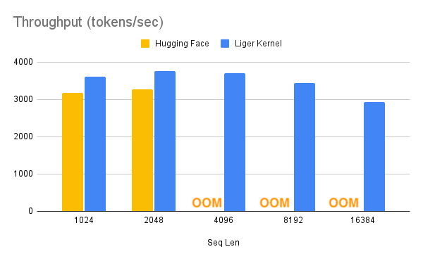
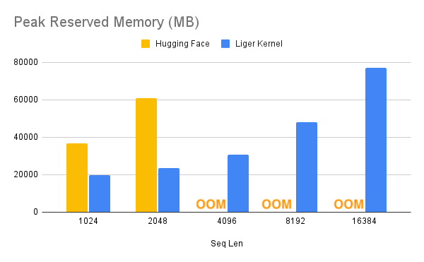

# Liger Kernel

**Liger Kernel** is a collection of Triton-native kernels designed specifically for LLM training. It aims to be **performant**, **correct**, and **lightweight**. We welcome contributions from the community to help us enhance and grow this project.

### ✨ Key Features
- **🚀 Performant:** All kernels are written in OpenAI Triton with optimized tuning, increasing multi-GPU training throughput by 20% and reducing memory usage by 60%.
- **✅ Correct:** Each kernel undergoes rigorous unit and convergence testing to ensure accuracy.
- **🌱 Lightweight:** The kernels have minimal dependencies, requiring only Torch and Triton—no extra libraries needed!

### 🎯 Target Audiences

- **Researchers**: Looking to compose models using efficient and reliable kernels for frontier experiments.
- **ML Practitioners**: Focused on maximizing GPU training efficiency with optimal, high-performance kernels.
- **Curious Novices**: Eager to learn how to write reliable Triton kernels to enhance training efficiency.

## 🌟 Overview

### Supercharge Your Model with Liger Kernel

Gain +20% throughput and -60% memory usage. Achieve longer context lengths and larger batch sizes.

| ⚡ Speed Up                 | 💾 Memory Reduction        |
|--------------------------|-------------------------|
|  |  |

> **Note:**  
> 1. Benchmark conditions: LLaMA 3-8B, Batch Size = 8, Data Type = bf16, Optimizer = AdamW, Gradient Checkpointing = True, Distributed Strategy = FSDP1 on 8 A100s. 
> 2. HuggingFace models start to OOM at 4K context length, whereas Liger Kernel scales up to 16K.  
> 3. **Fused Linear Cross Entropy Loss** is enabled to significantly reduce memory usage.

### ✨ Utilize Individual Kernels or Enhance Existing Models

| 🛠️ Patch Existing HF Model               | 🧩 Compose Your Own Model       |
|--------------------------|-------------------------|
|  |  |

## 🚀 Features

- +20% throughput and -60% memory usage for multi-GPU training.
- Unlock large vocabulary sizes, long contexts, or multi-head training.
- Minimal dependencies—only `torch` and `triton` are required.
- Hugging Face model compatible—speed up your models with just one line of code.
- Forward and backward passes implemented.
- 0% loss in correctness—kernels are validated through robust unit and convergence tests.
- Compatible with multi-GPU setups (PyTorch FSDP and DeepSpeed).
- Seamless integration with Torch Compile.

## 🔧 Installation

### Dependencies

- `torch >= 2.1.2`
- `triton >= 2.3.0`
- `transformers >= 4.40.1`

To install the stable version:

```bash
$ pip install liger-kernel 
```

To install the nightly version:

```bash
$ pip install liger-kernel-nightly
```

## 🚀 Getting Started

### 1. 🛠️ Patch Existing Hugging Face Models

```python
from liger_kernel.transformers import apply_liger_kernel_to_llama
from transformers import Trainer

# By adding this line, it automatically monkey patches the model with the optimized kernels
apply_liger_kernel_to_llama() 
model = transformers.AutoModelForCausalLM.from_pretrained("<some llama model>")
```

### 2. 🧩 Compose Your Own Model

```python
from liger_kernel.transformers import LigerFusedLinearCrossEntropyLoss
import torch.nn as nn
import torch

model = nn.Linear(128, 256).to("cuda")

# LigerFusedLinearCrossEntropyLoss fuses linear and cross entropy layer together and performs chunk-by-chunk computation to reduce memory
loss_fn = LigerFusedLinearCrossEntropyLoss()

input = torch.randn(4, 128, requires_grad=True, device="cuda")
target = torch.empty(4, dtype=torch.long, device="cuda").random_(256)

loss = loss_fn(model.weight, input, target)
loss.backward()
```

## ⚙️ Note on ML Compiler

### 1. ⚡ Torch Compile

Since Liger Kernel is 100% Triton-based, it works seamlessly with Torch Compile. In the following example, Liger Kernel can further optimize on top of Torch Compile, reducing the memory by more than half.

| Configuration                  | ⚡ Throughput (tokens/sec) | 💾 Memory Reserved (MB) |
|--------------------------------|----------------------------|-------------------------|
| Torch Compile                  | 3780                       | 66358                   |
| Torch Compile + Liger Kernel   | 3702                       | 31000                   |

> **Note:**  
> 1. **Fused Linear Cross Entropy Loss** is enabled.  
> 2. Benchmark conditions: LLaMA 3-8B, Batch Size = 8, Seq Len = 4096, Data Type = bf16, Optimizer = AdamW, Gradient Checkpointing = True, Distributed Strategy = FSDP1 on 8 A100s.
> 3. Tested on torch `2.5.0.dev20240731+cu118`

### 2. 🌩️ Lightning Thunder

*WIP*

## 📂 Structure

### Source Code

- `ops/`: Core Triton operations.
- `transformers/`: PyTorch `nn.Module` implementations built on Triton operations, compliant with the `transformers` API.

### Tests

- `transformers/`: Correctness tests for the Triton-based layers.
- `convergence/`: Patches Hugging Face models with all kernels, runs multiple iterations, and compares weights, logits, and loss layer by layer.

### Benchmark

- `benchmark/`: Execution time and memory benchmarks compared to Hugging Face layers.

## 🔧 APIs

### Patching

| **Model**   | **API**                                                      | **Supported Operations**                                                |
|-------------|--------------------------------------------------------------|-------------------------------------------------------------------------|
| LLaMA (2 & 3) | `liger_kernel.transformers.apply_liger_kernel_to_llama`   | RoPE, RMSNorm, SwiGLU, CrossEntropyLoss, FusedLinearCrossEntropy        |
| Mistral     | `liger_kernel.transformers.apply_liger_kernel_to_mistral`  | RoPE, RMSNorm, SwiGLU, CrossEntropyLoss        |
| Mixtral     | `liger_kernel.transformers.apply_liger_kernel_to_mixtral`  | RoPE, RMSNorm, SwiGLU, CrossEntropyLoss        |


### 🧩 Kernels

| **Kernel**                | **API**                                                     | **Description** |
|---------------------------|-------------------------------------------------------------|-----------------|
| RMSNorm                    | `liger_kernel.transformers.LigerRMSNorm`                    | [RMSNorm Paper](https://arxiv.org/pdf/1910.07467) |
| RoPE                       | `liger_kernel.transformers.liger_rotary_pos_emb`            | [RoPE Paper](https://arxiv.org/pdf/2104.09864)    |
| SwiGLU                     | `liger_kernel.transformers.LigerSwiGLUMLP`                  | [SwiGLU Paper](https://arxiv.org/pdf/2002.05202)  |
| CrossEntropy               | `liger_kernel.transformers.LigerCrossEntropyLoss`           | [PyTorch CrossEntropyLoss Documentation](https://pytorch.org/docs/stable/generated/torch.nn.CrossEntropyLoss.html) |
| FusedLinearCrossEntropy    | `liger_kernel.transformers.LigerFusedLinearCrossEntropyLoss`| Inspired by [Efficient Cross Entropy](https://github.com/mgmalek/efficient_cross_entropy), with additional optimizations |


## 🛣️ Roadmap

WIP

## 🤝 Contributing

WIP

## 📜 License

WIP

## Citation

WIP