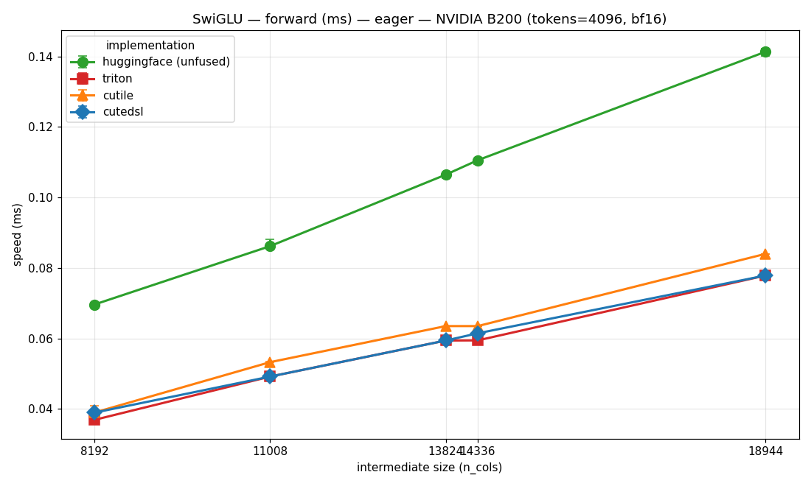
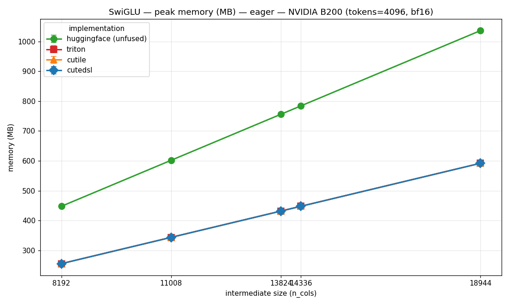
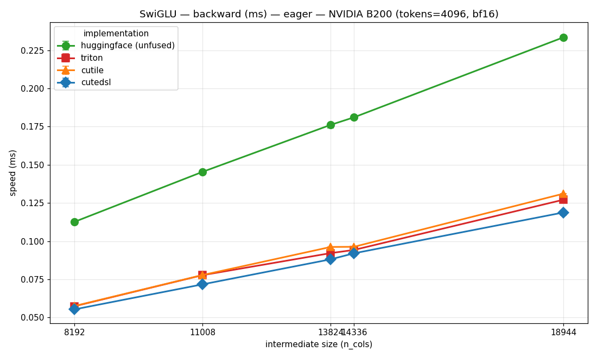
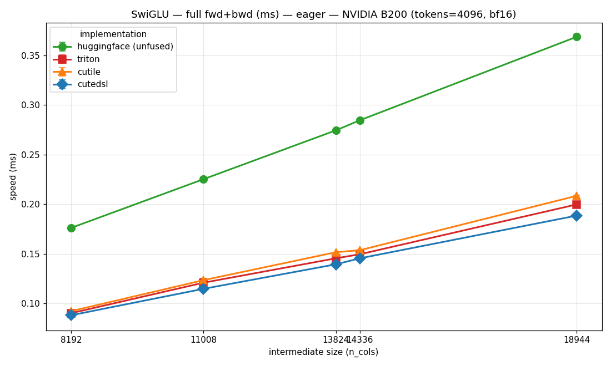

# One Activation, Three DSLs: Triton vs cuTile vs CuTe DSL for SwiGLU

*A head-to-head study of Liger-Kernel's SwiGLU backends on an NVIDIA B200.*

This is the companion to the [RoPE comparison](ROPE_KERNELS_COMPARISON.md). Same
question, different op: Liger-Kernel ships **three** implementations of the SwiGLU
activation, and we want to know whether three different GPU DSLs, targeting the same
memory-bound op, actually behave the same.

| Backend | Language | Source |
|---|---|---|
| **Triton** | OpenAI Triton | `src/liger_kernel/ops/swiglu.py` |
| **cuTile** | NVIDIA cuTile (`cuda.tile`) | `src/liger_kernel/ops/cutile/ops/swiglu.py` |
| **CuTe DSL** | NVIDIA CUTLASS Python DSL (`cutlass.cute`) | `src/liger_kernel/ops/cutedsl/ops/swiglu.py` |

All numbers: **NVIDIA B200 (sm_100)**, bf16, via
`benchmark/scripts/benchmark_swiglu_backends.py` (all backends + a HuggingFace-style
unfused reference in one process). Scope is the **Level-1 elementwise kernel**
`c = silu(a)·b` (`a`=gate, `b`=up) — *not* the fused-linear / fused-MLP variants that
fold in the gate/up GEMMs (a separate story).

> **Update (this revision).** The first version of this study found two rough edges:
> (1) cuTile ran **~1.1–1.6× slower on FFN widths not divisible by 2048** (a discrete
> "cliff" that hit the whole Qwen2.5 family), and (2) CuTe DSL's SwiGLU was **not
> CUDA-graph-capturable**. Both have since been fixed and merged. This revision re-runs
> the whole comparison against the current kernels — and the story is now much simpler.

---

## TL;DR

1. **All three fused backends beat the unfused reference ~2×**, and all use ~1.75× less
   memory. SwiGLU is memory-bound; fusing `silu` + multiply into one kernel removes an
   intermediate tensor and a launch.
2. **All three now track each other within ~5–8%, at every FFN width.** Triton and
   CuTe DSL are neck-and-neck (CuTe DSL is a hair faster on the full pass); cuTile
   carries a small, **uniform** ~5–8% overhead — but the old width-dependent cliff is
   **gone**.
3. **The cuTile non-power-of-2 cliff is fixed.** At 13824 (Qwen2.5-14B) cuTile went from
   **94.2 µs → 63.5 µs** forward — from 1.59× slower than Triton to 1.07×. It now behaves
   identically on ÷2048 and non-÷2048 widths.
4. **CuTe DSL is now CUDA-graph-capturable**, so it appears in the device-only (graph)
   numbers too — previously its capture was empty and its graph time was unmeasurable.
5. **Eager mode already tells the truth here** — SwiGLU is a big enough kernel that host
   launch overhead is a small fixed cost, not the whole story (the opposite of RoPE).

---

## Background: what SwiGLU is, and why fuse it

Every modern transformer MLP is a SwiGLU MLP. Two linear projections of the input —
**gate** (`a`) and **up** (`b`), each `[tokens, intermediate]` — are combined by:

```
out = silu(a) * b        silu(x) = x * sigmoid(x)
```

then projected back down. It's a purely **elementwise, memory-bound** op over large
tensors (`intermediate` is 11k–19k in real models). The unfused way (plain PyTorch)
is two kernels with an intermediate written to HBM:

```python
s   = F.silu(a)   # kernel 1 -> writes s to HBM
out = s * b       # kernel 2 -> reads s, b
```

The fused SwiGLU kernel (`LigerSiLUMulFunction`) does it in one pass — read `a`,`b`,
write `out`, nothing in between. That's the kernel all three backends implement and
what we compare.

---

## Act I — Everybody beats the unfused reference

Eager, tokens = 4096, forward pass (µs), x = intermediate size:

| n_cols | huggingface | triton | cutile | cutedsl | model |
|-------:|------------:|-------:|-------:|--------:|:------|
| 8192  | 69.6  | 36.9 | 38.9 | 38.9 | (pow2) |
| 11008 | 86.2  | 49.2 | 53.2 | 49.2 | Llama-2-7B |
| 13824 | 106.5 | 59.4 | 63.5 | 59.4 | **Qwen2.5-14B** |
| 14336 | 110.6 | 59.4 | 63.5 | 61.4 | Llama-3-8B, Mixtral-8x7B |
| 18944 | 141.3 | 77.8 | 84.0 | 77.8 | **Qwen2.5-7B** |



The unfused reference (● green) is ~2× slower than the fused kernels across the board —
it pays for the extra intermediate and the second launch. Memory tells the same story:
all three fused backends are **identical** and ~1.75× smaller than unfused.

| n_cols | huggingface | fused (all 3) | ratio |
|-------:|------------:|--------------:|------:|
| 13824 | 756 MB | 432 MB | 1.75× |
| 18944 | 1036 MB | 592 MB | 1.75× |



Note what is **not** in this plot anymore: in the first revision, cuTile (△ orange)
spiked well above Triton and CuTe DSL at 13824 and 18944. It now sits just barely above
them at every width — a smooth line, no jump. That is Act III.

---

## Act II — Eager tells the truth, and all three now graph-capture

In the RoPE study, eager numbers were *misleading*: RoPE is a tiny kernel (~5 µs), so
the ~15 µs of Python/launch overhead dominated and hid all differences — we needed
CUDA graphs to see real device time.

**SwiGLU is different.** It's a much bigger kernel (tensors are `4096 × up-to-18944`),
so fixed host launch overhead is a *small fraction* of the total. For Triton at 13824:
**59.4 µs eager vs 51.5 µs device (CUDA graph)** — only ~8 µs of overhead on a ~55 µs
kernel. Eager and device rank the backends the same way.

Device-only (CUDA graph) forward, tokens = 4096 (µs):

| n_cols | triton | cutile | cutedsl |
|-------:|-------:|-------:|--------:|
| 8192  | 29.9 | 33.0 | 31.3 |
| 13824 | 51.5 | 54.7 | 54.1 |
| 18944 | 71.4 | 75.8 | 74.5 |

Two things changed here since the first revision:

- **CuTe DSL now appears in this table.** Previously its SwiGLU launch didn't thread
  PyTorch's current stream, so a CUDA-graph capture recorded *nothing* and replay was a
  ~0 µs no-op (unmeasurable). The launch now runs on the current/capture stream (the
  same treatment CuTe DSL RoPE already had), so capture is complete and replay is
  bit-identical to eager.
- **There is no cuTile spike** in the device numbers either — confirming the old cliff
  was a genuine device cost, and its removal is a genuine device win, not a
  launch-overhead artifact.

---

## Act III — The cliff that was, and how it was closed

### What the cliff was

cuTile's SwiGLU used a single uniform tile per row and fell back to a bounds-checked
("masked") path whenever no large power-of-two tile divided `n_cols` evenly — i.e.
whenever `n_cols % 2048 != 0`. That path bounds-checks a ragged tail on every chunk and
ran materially slower. Because real FFN widths are usually *not* multiples of 2048, this
hit a large swath of mainstream models: the entire **Qwen2.5 family**, **Llama-2**,
smaller DeepSeek.

First-revision forward, tokens = 4096 — **before** the fix:

| n_cols | ÷2048? | cutile (old) | triton | ratio |
|-------:|:------:|-------------:|-------:|------:|
| 14336 | ✓ | 63.5 | 59.4 | 1.07× |
| 11008 | ✗ | 55.3 | 49.2 | 1.12× |
| 18944 | ✗ | **98.3** | 77.8 | 1.26× |
| 13824 | ✗ | **94.2** | 59.4 | **1.59×** |

### The fix (and why gather, not block-load)

The masked path is *correct*, just slower because it bounds-checks a ragged tail. The
fix is to remove the ragged tail entirely via **exact-fit power-of-two-sum tiling**:
decompose each row into a sum of aligned pow2 chunks, each fully in-bounds, so the fast
`check_bounds=False` path covers *any* width:

```
13824 = 4096 + 4096 + 4096 + 1024 + 512   (all clean, coalesced, bounds-check-free)
```

One subtlety we measured along the way: on B200, cuTile's block `ct.load`/`ct.store`
is actually **~1.5–2× slower** than `ct.gather`/`ct.scatter` with a contiguous
`ct.arange` for this row-wise pattern (block emits ~3× more address-arithmetic
instructions for byte-identical, equally-coalesced memory traffic). So the fix keeps
gather/scatter and only changes the *tiling* — exact-fit chunks, all on the fast path.
The forward base tile was also tuned to 2048 (best DRAM utilization; 4096 tiles become
issue-bound). The backward was left on its uniform path — its per-element compute hides
the bounds-check predicate, so it never had a cliff.

### After the fix

Forward, tokens = 4096 — **after**:

| n_cols | ÷2048? | cutile (new) | triton | ratio | was |
|-------:|:------:|-------------:|-------:|------:|----:|
| 14336 | ✓ | 63.5 | 59.4 | 1.07× | 1.07× |
| 11008 | ✗ | 53.2 | 49.2 | 1.08× | 1.12× |
| 18944 | ✗ | 84.0 | 77.8 | 1.08× | 1.26× |
| 13824 | ✗ | **63.5** | 59.4 | **1.07×** | **1.59×** |

The `÷2048?` column no longer predicts anything — cuTile is a uniform ~1.05–1.08× of
Triton at every width. The forward, backward and full passes all show the same flat
picture now:




### The cliff was token-independent — and so is its absence

Sweeping tokens at a "good" (14336, ÷2048) and "bad" (13824, not ÷2048) width used to
show 13824 running ~1.5–1.65× slower at *every* token count. Now the two widths are
indistinguishable (forward, µs):

| tokens | 1024 | 2048 | 4096 | 8192 |
|-------:|-----:|-----:|-----:|-----:|
| 13824 cutile | 24.6 | 36.9 | 63.5 | 114.6 |
| 14336 cutile | 24.6 | 36.9 | 63.5 | 114.7 |
| 13824 triton | 20.5 | 32.8 | 59.4 | 108.5 |

cuTile at 13824 now equals cuTile at 14336 to within noise, at every token count.

---

## Act IV — Backward and full pass

Backward and full (fwd+bwd) were never the cliff's home (the backward's per-element math
hides the bounds check), and they remain a three-way tie. Eager, tokens = 4096 (µs):

| n_cols | triton bwd | cutile bwd | cutedsl bwd | triton full | cutile full | cutedsl full |
|-------:|-----------:|-----------:|------------:|------------:|------------:|-------------:|
| 11008 | 77.7 | 77.8 | 71.7 | 120.9 | 123.4 | 114.7 |
| 13824 | 92.2 | 96.2 | 88.1 | 145.4 | 151.6 | 139.4 |
| 18944 | 127.1 | 131.1 | 118.8 | 199.7 | 208.4 | 188.4 |

CuTe DSL edges out the other two on the full pass (~3–5%); cuTile trails by a similarly
small margin. No width-dependent surprises.

---

## Why Triton and CuTe DSL never had the cliff

- **Triton** has a masked block store (`tl.store(..., mask=...)`), so one kernel pads
  and masks *any* width while staying coalesced — plus a Blackwell column-tiling path
  for wide rows.
- **CuTe DSL** uses a vectorized/scalar layout with no power-of-two tile constraint.

cuTile's block API imposed a power-of-two tile-shape constraint that the other two
sidestep; the exact-fit decomposition works within that constraint to get the same
result. Same hardware, same op — the DSL's expressiveness (and how you work around its
limits) is the variable.

---

## Conclusions

1. **For standard training, pick any of the three.** They tie within ~5–8% at every FFN
   width now, and all beat the unfused reference ~2× at ~1.75× less memory.
2. **The cuTile footgun is gone.** FFN widths not divisible by 2048 (the whole Qwen2.5
   family, Llama-2) used to run ~1.1–1.6× slower; after the exact-fit pow2 tiling fix
   they run at the same ~1.05–1.08× of Triton as the aligned widths. You no longer need
   to know your model's intermediate size before choosing `LIGER_KERNEL_IMPL=cutile`.
3. **CuTe DSL is now CUDA-graph-safe** for SwiGLU (it threads the current stream), so it
   composes with graph-captured training loops just like Triton and cuTile.
4. **Methodology note**: eager is a fair measurement for SwiGLU (big kernel, not
   host-bound) — the opposite of RoPE. CUDA graphs are only needed to *confirm* device
   costs (and, now, to show all three capture correctly).
5. **The differences were about DSL expressiveness, not GPU physics** — the same lesson
   as RoPE — and they were fixable inside each DSL without changing the math.

---

### Reproducing

```bash
cd benchmark/scripts

# sweep intermediate size; eager + CUDA-graph
LIGER_BENCH_TARGET=swiglu_ncols  python benchmark_swiglu_backends.py --sweep-dim n_cols  --timing both  --overwrite

# sweep tokens at a ÷2048 (14336) and non-÷2048 (13824) width
LIGER_BENCH_TARGET=swiglu_tokens python benchmark_swiglu_backends.py --sweep-dim tokens --timing both --overwrite
```

- `speed` = eager (host-inclusive) · `speed_graph` = CUDA-graph device-only · `memory` = peak MB (full pass)
- `LIGER_BENCH_TARGET=<name>` routes results to `benchmark/data/all_benchmark_data_<name>.csv`.
- Plots (distinct marker per backend: ● unfused, ■ triton, ▲ cutile, ◆ cutedsl) are generated from the `_ncols` CSV.

*Environment: NVIDIA B200 (sm_100), CUDA 13, torch 2.11 (cu130), triton 3.6,
nvidia-cutlass-dsl 4.6, cuda-tile, bf16. cuTile exact-fit forward + CuTe DSL
CUDA-graph stream fix both merged to main.*
