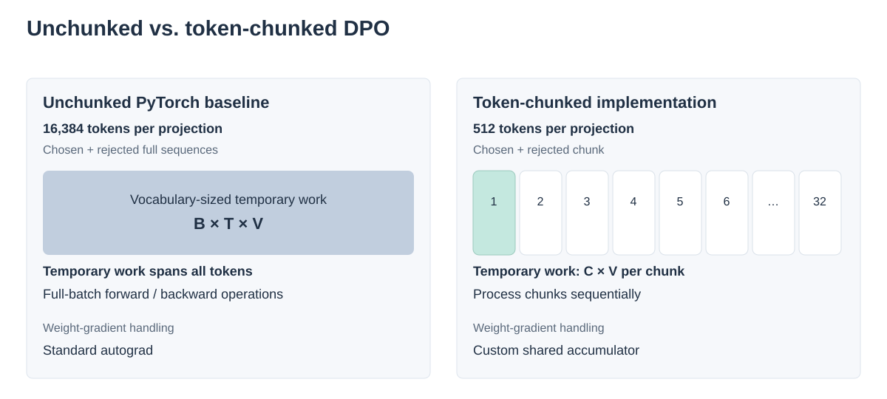
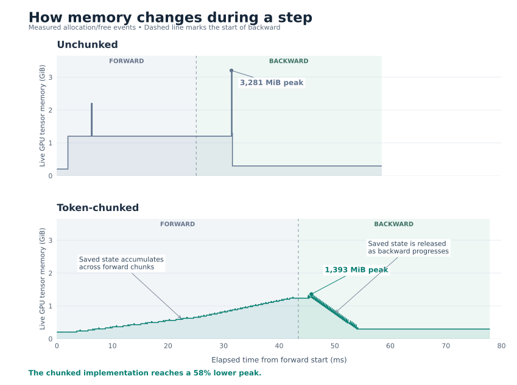

# Chunked DPO Loss: (batch × sequence)-level chunking with in-place gradient accumulation

This document explains the design and rationale behind
[`LigerChunkedLinearPreferenceBase`](https://github.com/cyr0930/Liger-Kernel/blob/feat/chunked_dpo/src/liger_kernel/chunked_loss/chunked_linear_preference.py#L36) /
[`LigerChunkedLinearDPOLoss`](https://github.com/cyr0930/Liger-Kernel/blob/feat/chunked_dpo/src/liger_kernel/chunked_loss/dpo_loss.py#L193)
and the [`ChunkMatmul`](https://github.com/cyr0930/Liger-Kernel/blob/feat/chunked_dpo/src/liger_kernel/chunked_loss/chunked_linear_preference.py#L8)
autograd function (commits [`b442602`](https://github.com/cyr0930/Liger-Kernel/commit/b44260260d4197924b0915a5f3180b4208526d4f)
and [`cf8d269`](https://github.com/cyr0930/Liger-Kernel/commit/cf8d269c88539586d0d9829c87757cb0d82736a4)).

**Tested setting:** use `LigerChunkedLinearDPOLoss(compiled=True, use_ref_model=True)`
with a trainable policy weight and a frozen reference weight (`requires_grad=False`);
provide `ref_input` and `ref_weight`. This implementation requires the reference
path (`use_ref_model=False` is not supported). Compilation here means the loss's
internal chunk compilation, not wrapping the whole loss in `torch.compile`.
The BF16 memory behavior below was tested at commit `85a1c9c` on A30 / PyTorch 2.10.0+cu128.

With `compiled=False`, chunking still reduces temporary workspace, but autograd
retains all chunks' FP32 vocabulary log-probabilities for backward; the compiled
retained-state savings described below do not apply.

## Problem

The upstream [`LigerFusedLinearPreferenceBase`](https://github.com/cyr0930/Liger-Kernel/blob/main/src/liger_kernel/chunked_loss/fused_linear_preference.py)
chunks the DPO loss along the **batch** dimension over chosen/rejected pairs. Each chunk therefore still contains the full
sequence length, and its logits are of shape `(chunk_B, T, V)`.

In the typical DPO regime — long sequences, small effective batch — a "chunk" is
essentially the whole batch, so batch-level chunking degenerates into gradient
accumulation and does **not** split the sequence-dependent logit / log-softmax
working set within a pair.

The SFT approach in the [Liger-Kernel report (§3.2, FLCE)](https://openreview.net/pdf?id=36SjAIT42G)
([arXiv version](https://arxiv.org/html/2410.10989v2#S3.SS2)) chunks over `B·T` and
computes each chunk's cross-entropy gradients **during forward**. SFT loss is a
sum of token losses (up to a known normalization), so each chunk's contribution
to the hidden-state and weight gradients can be computed immediately, accumulated,
and its vocabulary-sized intermediates released.

[DPO](https://arxiv.org/abs/2305.18290) instead applies a nonlinear loss to complete
sequence scores. For one pair, let `s_w` and `s_l` be the summed policy token
log-probabilities and `r_w`, `r_l` the reference scores:

```text
z = beta * ((s_w - s_l) - (r_w - r_l))
L = -log(sigmoid(z))
dL/ds_w = -beta * sigmoid(-z)     # rejected score has the opposite sign
```

Every chosen token's gradient is scaled by this same pair-dependent factor,
which is unknown until all chunks contributing to `z` have been processed.
Thus FLCE's immediate accumulation of final loss gradients cannot be reused
unchanged; computing a separate DPO loss per chunk would change the objective.
This implementation first gathers complete sequence scores, then backpropagates
through the chunks with the correct factor. A two-pass/recomputation design or
retaining per-pair gradient contributions for deferred scaling could also adapt
the FLCE idea; this implementation is one solution, not a requirement of DPO.

## Design

### Forward: chunk at (batch × sequence) granularity

`LigerChunkedLinearPreferenceBase.forward` flattens chosen and rejected inputs to
`(B/2 · T, H)`, splits each half into `max(1, T // chunk_size)` token chunks,
and for each chunk computes:

- `logits_chunk = ChunkMatmul.apply(input_chunk, weight)` (lm-head projection)
- `log_probs_chunk = F.log_softmax(logits_chunk, dim=-1, dtype=torch.float32)`
- gathered per-token logps (and optionally the NLL loss term)

Per-token logps are collected across chunks, reassembled with `cat → view → sum(-1)`
into per-sequence logps, and the preference loss is computed once on that tiny
sequence-level graph.

Here `chunk` (or `C` in the diagram below) means the actual token count per projection,
including both chosen and rejected tokens; it grows with the number of pairs.



Memory consequence under `compiled=True` (as observed in the tested configuration):

- **Retained until backward:** each chunk's logits; removing this retained state
  would require additional recomputation.
- **Transient work:** fp32 log-softmax and its backward operate per chunk
  (`O(chunk · V)`), instead of on the full batch (`O(B · T · V)`).

The `dtype=torch.float32` argument requests fp32 log-softmax without an explicit
`.float()` in the source; avoiding separate cast allocations depends on compiler fusion.

### Backward: `ChunkMatmul` — streamed, in-place weight-gradient accumulation

Backward walks the chunks in reverse. With a plain autograd matmul, **each chunk's
backward would allocate a fresh `(V × H)` weight gradient** before `AccumulateGrad`
sums it into `weight.grad`. At e.g. V=128K, H=4096, fp32 that is ~2 GB of transient
allocation *per chunk*.

`ChunkMatmul` takes manual ownership of this gradient:

```python
class ChunkMatmul(torch.autograd.Function):
    buf: dict[str, torch.Tensor | int] = {"count": 0}

    @staticmethod
    def forward(ctx, x, weight):
        if weight.requires_grad:
            ctx.save_for_backward(x, weight)
            ChunkMatmul.buf["count"] += 1      # one backward call is owed
        return x.matmul(weight.T)

    @staticmethod
    def backward(ctx, grad_out):
        x, weight = ctx.saved_tensors
        grad_x = grad_out.matmul(weight)        # stateless, per chunk, as usual
        if "grad" not in ChunkMatmul.buf:
            ChunkMatmul.buf["grad"] = torch.zeros_like(weight)
        ChunkMatmul.buf["grad"].addmm_(          # fused multiply-accumulate,
            grad_out.view(-1, grad_out.shape[-1]).T,   # no intermediate (V, H) tensor
            x.view(-1, x.shape[-1]),
        )
        ChunkMatmul.buf["count"] -= 1
        if ChunkMatmul.buf["count"] == 0:       # last chunk's backward:
            grad_w = ChunkMatmul.buf["grad"]    # hand the completed sum to autograd
            del ChunkMatmul.buf["grad"]         # reset for the next step
        else:
            grad_w = None                       # earlier chunks contribute nothing
        return grad_x, grad_w
```

Key points:

- `grad_x` is pure and identical to vanilla autograd — failure modes of the buffer
  logic are confined to the weight gradient.
- All chunks accumulate into **one** buffer via `addmm_`; only the *last* backward
  (detected by the reference count reaching zero) returns the sum, so autograd
  performs a single accumulation into `weight.grad` and nothing is double-counted.
- At the end of a normally completed step, `count == 0` and the buffer is deleted:
  the state at the start of step N+1 is identical to step 1, so a one-step gradient
  equivalence check extends to the whole steady-state training loop by induction.
- `save_for_backward(x, weight)` saves references rather than copies, keeping
  the input and weight available until backward.

### Assumptions / limitations

`ChunkMatmul` is a correct *protocol for this training loop*, not a general operator:

- One trainable weight per accumulation cycle (the buffer is keyed by nothing).
  The reference model's weight must be frozen (`requires_grad=False`) so the ref
  path never touches the counter.
- Every forward with grad enabled must be matched by exactly one backward before the
  next cycle. A forward whose backward never runs (validation with grad enabled, an
  exception between forward and backward) leaves `count > 0` and silently corrupts
  subsequent weight gradients. A cheap guard:

  ```python
  assert ChunkMatmul.buf["count"] == 0  # at the top of forward
  ```
- Single-threaded, single-stream execution; no `retain_graph` / double backward.

## Result

With `compiled=True`, chunking bounds temporary vocabulary-sized work to
`O(chunk · V)`, while compilation avoids retaining the full fp32 vocabulary
log-probabilities for every chunk. In the tested configuration, the dominant
saved vocabulary-sized state is bf16 logits (~`2 · B · T · V` bytes); fp32
log-softmax is recomputed per chunk during backward. The much smaller gathered
target-token and sequence scores still construct the DPO loss. Compiler
partitioning can vary; these saved-state costs are not a peak-memory formula.
Together with `ChunkMatmul`, this reduces memory through:

1. the full-batch fp32 log-softmax pipeline is replaced by a per-chunk transient, and
2. per-chunk `(V × H)` weight-gradient allocations in backward are replaced by a
   single in-place accumulator.

In this implementation, the remaining floor is the retained per-chunk logits (visible as a
"staircase" in a [memory snapshot](https://pytorch.org/docs/stable/torch_cuda_memory.html)); removing it would require a two-pass /
recomputation design, since DPO forces all sequence logps to exist before backward.

Measured with one pair, BF16, `T=8192`, `H=1024`, `V=32768`, and chunk size 256:
compiled unchunked PyTorch peaked at **3,281 MiB**, versus **1,393 MiB (58% lower)**
for this compiled implementation, including its custom gradient accumulator.
These are lm-head + DPO forward/backward peaks, including the reference, measured
after two warmups across three iterations. They are not whole-model training peaks.
Compiled gradient relative L2 errors versus unchunked PyTorch were below
**0.0032% FP32** and **0.7% BF16** in the tested cases.

The timeline below records one additional warmed-up forward/backward step for each
implementation. It plots live requested tensor memory from allocator events;
peak labels use allocated bytes (the difference is under 1 MiB). Time is measured
from allocator timestamps with tracing enabled, not a throughput benchmark.


