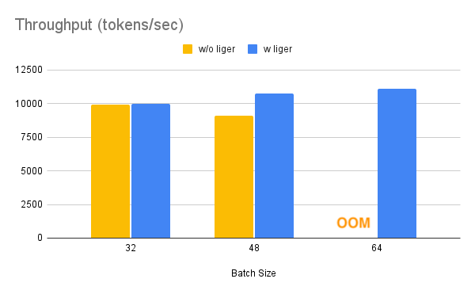
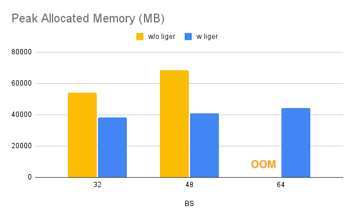

# Liger-Kernel Example with HuggingFace Trainer

## How to Run
```bash
pip install -r requirements.txt
sh run.sh
```

**Notes**
1. The example uses Llama3 model that requires community license agreement and HuggingFace Hub login. If you want to use Llama3 in this example, please make sure you have done the followings:
    * Agree on the community license agreement https://huggingface.co/meta-llama/Meta-Llama-3-8B
    * Run `huggingface-cli login` and enter your HuggingFace token
2. The default hyperparameters and configurations work on single node with 4xA100 GPUs. For running on device with less GPU RAM, please consider reducing the per-GPU batch size and/or enable `CPUOffload` in FSDP.


## Benchmark Result

Benchmark conditions: LLaMA 3-8B, Alpaca Dataset, Max seq len = 512, Data Type = bf16, Optimizer = AdamW, Gradient Checkpointing = True, Distributed Strategy = FSDP1 on 4 A100s.

The throughput increases by approximately 20% with more data, but the GPU memory is reduced by 40%. This means you can train the model on smaller GPUs, with larger batch sizes, or with longer sequence lengths at no additional cost.



