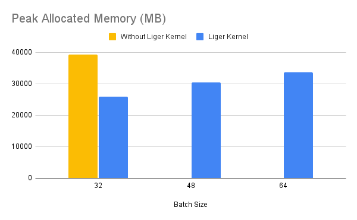
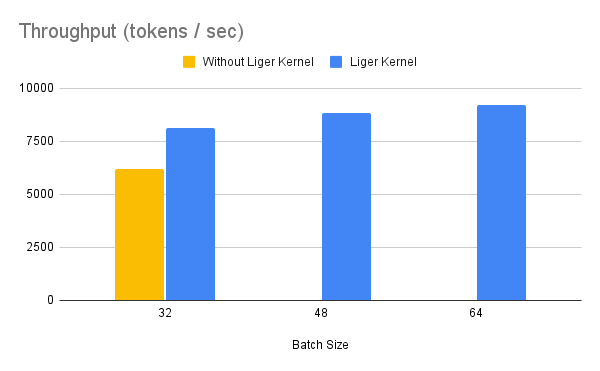

# Liger-Kernel Example with HuggingFace Trainer

## How to Run

### Locally on a GPU machine
You can run the example locally on a GPU machine. The default hyperparameters and configurations work on single node with 4xA100 80GB GPUs.

```bash
pip install -r requirements.txt
sh run_{MODEL}.sh
```

### Remotely on Modal
If you do not have access to a GPU machine, you can run the example on Modal. Modal is a serverless platform that allows you to run your code on a remote GPU machine. You can sign up for a free account at [Modal](https://www.modal.com/).

```bash
pip install modal
modal setup  # authenticate with Modal
modal run launch_on_modal.py --script "run_qwen2_vl.sh"
```

**Notes**
1. This example uses an optional `use_liger` flag. If true, it does a 1 line monkey patch to apply liger kernel.
2. The example uses Llama3 model that requires community license agreement and HuggingFace Hub login. If you want to use Llama3 in this example, please make sure you have done the followings:
    * Agree on the community license agreement https://huggingface.co/meta-llama/Meta-Llama-3-8B
    * Run `huggingface-cli login` and enter your HuggingFace token
3. The default hyperparameters and configurations work on single node with 4xA100 80GB GPUs. For running on device with less GPU RAM, please consider reducing the per-GPU batch size and/or enable `CPUOffload` in FSDP.


## Benchmark Result

### LLaMA
Benchmark conditions: LLaMA 3-8B, Alpaca Dataset, Max seq len = 512, Data Type = bf16, Optimizer = AdamW, Gradient Checkpointing = True, Distributed Strategy = FSDP1 on 4 A100s.

Throughput improves by around 20%, while GPU memory usage drops by 40%. This allows you to train the model on smaller GPUs, use larger batch sizes, or handle longer sequence lengths without incurring additional costs.


### QWEN
Benchmark conditions: Qwen2-7B, Alpaca Dataset, Max seq len = 512, Data Type = bf16, Optimizer = AdamW, Gradient Checkpointing = True, Distributed Strategy = FSDP1 on 4 A100s.

Throughput improves by around 10%, while GPU memory usage drops by 50%.


### GEMMA 7B
Benchmark conditions: Gemma-7B, Alpaca Dataset, Max seq len = 512, Data Type = bf16, Optimizer = AdamW, Gradient Checkpointing = True, Distributed Strategy = FSDP1 on 4 A100s.

Throughput improves by around 24%, while GPU memory usage drops by 33%.



