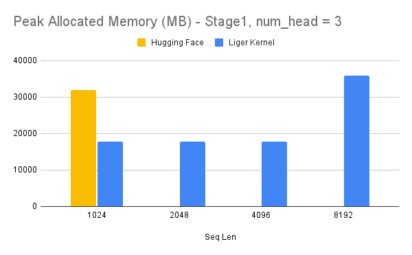
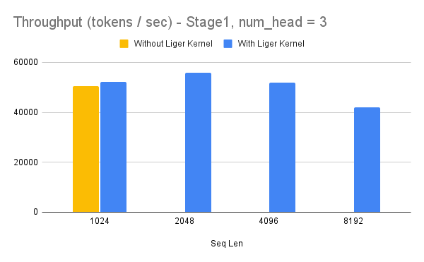
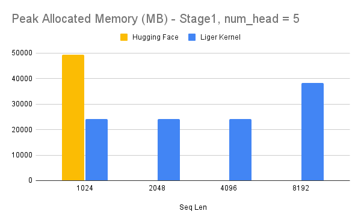
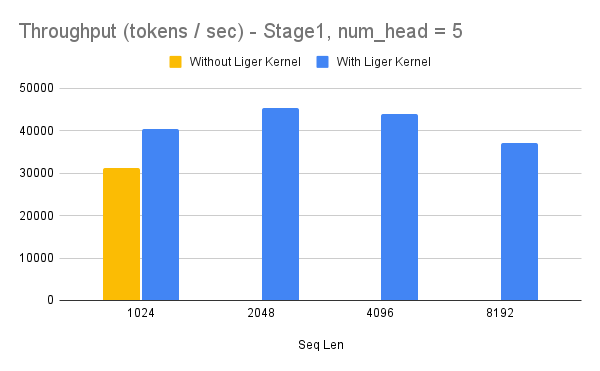
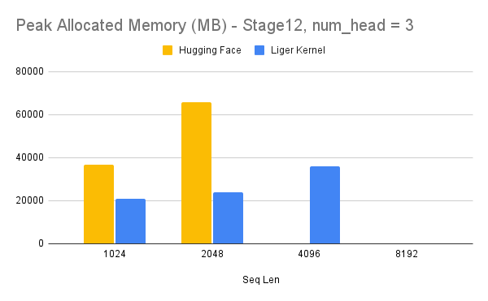
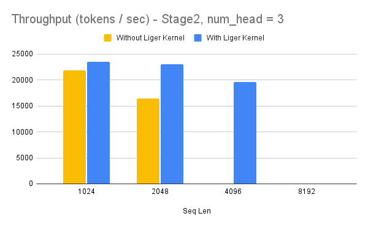
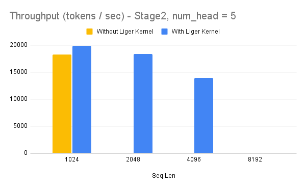

# Liger-Kernel Example with Medusa

Medusa is a simple framework that democratizes the acceleration techniques for LLM generation with multiple decoding heads. [[repo](https://arxiv.org/abs/2401.10774)], [[paper](https://arxiv.org/abs/2401.10774)]

During training, Medusa requires adding \(k\) decoding heads to the hidden states right before the regular LM head \(h_t\). The \(k\)-th head is used to predict the token in the \((t + k + 1)\)-th position of the next tokens (the original language model head is used to predict the \((t + 1)\)-th position). 

The Liger fused CE kernel is highly effective in this scenario, eliminating the need to materialize logits for each head, which usually consumes a large volume of memory due to the extensive vocabulary size (e.g., for LLaMA-3, the vocabulary size is 128k). The introduction of multiple heads can easily lead to OOM (Out of Memory) issues. However, thanks to the efficient Liger fused CE, which calculates the gradient in place and doesn't materialize the logits, we have observed very effective results. This efficiency opens up more opportunities for multi-token prediction research and development.


# Instructions to Run the Training Script

```
git clone git@github.com:linkedin/Liger-Kernel.git
cd {PATH_TO_Liger-Kernel}/Liger-Kernel/
pip install -e .
cd {PATH_TO_Liger-Kernel}/Liger-Kernel/examples/medusa
pip install -r requirements.txt
sh scripts/llama3_8b_medusa.sh
```

**Notes**
1. This example uses an optional `use_liger` flag. If true, it does a monkey patch to apply liger kernel with medusa heads.
2. The example uses Llama3 model that requires community license agreement and HuggingFace Hub login. If you want to use Llama3 in this example, please make sure you have done the followings:
    * Agree on the community license agreement https://huggingface.co/meta-llama/Meta-Llama-3-8B
    * Run `huggingface-cli login` and enter your HuggingFace token
3. The default hyperparameters and configurations work on single node with 8xA100 GPUs. For running on device with less GPU RAM, please consider reducing the per-GPU batch size and/or enable `CPUOffload` in FSDP.
4. We are using a smaller sample of shared GPT data primarily to benchmark performance. The example requires hyperparameter tuning and dataset selection to work effectively, also ensuring the dataset has the same distribution as the LLaMA pretraining data. Welcome contribution to enhance the example code.


# Memory Profiling Result

> **Note:**  
> 1. Benchmark conditions: LLaMA 3-8B, Batch Size = 6, Data Type = bf16, Optimizer = AdamW, Gradient Checkpointing = True, Distributed Strategy = FSDP1 on 8 A100s.

## Stage1

Stage1 refers to Medusa-1 where the backbone model is frozen and only weights of LLM heads are updated.

```
# Modify this flag in llama3_8b_medusa.sh to True enables stage1 
--medusa_only_heads True
```

### num_head = 3




### num_head = 5




## Stage2

```
# Modify this flag to False in llama3_8b_medusa.sh enables stage2
--medusa_only_heads False
```

Stage2 refers to Medusa-2 where all the model weights are updated incuding backbone model and llm heads.

### num_head = 3




### num_head = 5




