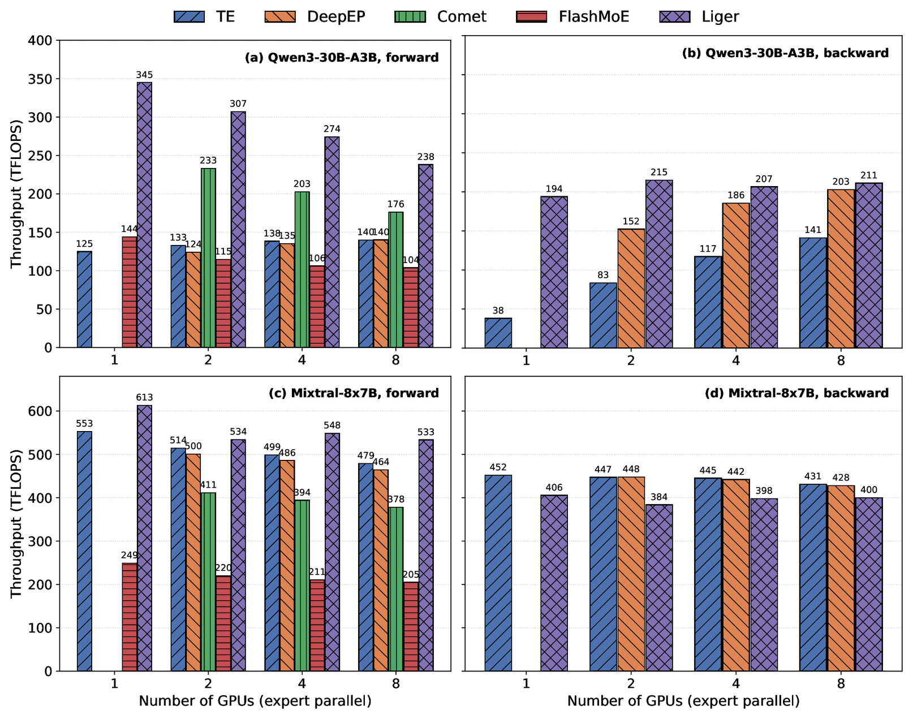
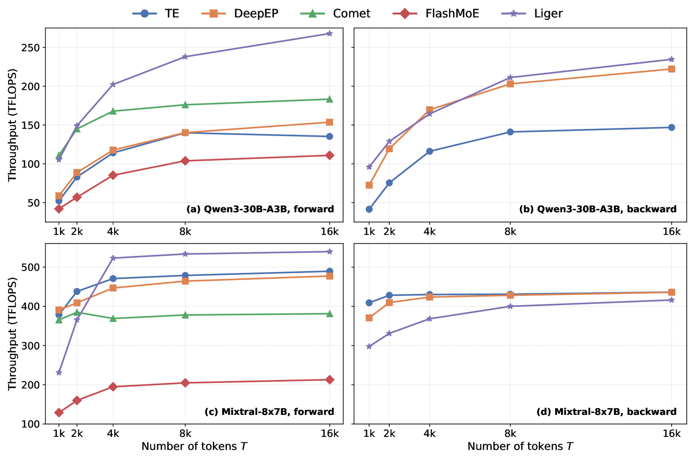
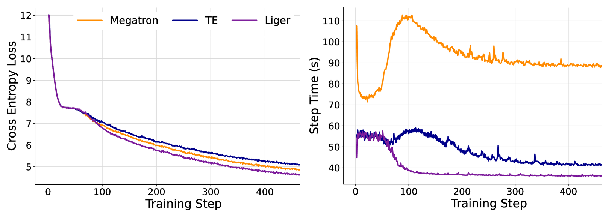

# LigerCute — native MoE kernels (CUTLASS + NVSHMEM)

## Overview

Liger MoE is a fused expert-parallel MoE implementation for NVIDIA Hopper and
Blackwell GPUs. A persistent kernel uses warp specialization to overlap
NVSHMEM communication with CUTLASS matrix multiplication: communication warps
move remote token tiles while the remaining warps execute the expert MLP. Both
the forward and backward passes are fused, use statically sized symmetric
buffers, and support CUDA Graph execution without a token-capacity limit.

### Hopper results

The accompanying ICLR 2027 evaluation reports the following BF16 results. These
are benchmark snapshots from the paper environment (CUDA 12.9), not performance
guarantees for every model or system.

| Evaluation | Headline result |
|---|---|
| Standalone MoE kernels | Up to **32% lower forward latency** and **7% lower backward latency** than the strongest compared implementation |
| Communication-intensive H200 cases | **10–35% higher forward throughput** than Comet; selected backward cases reach up to **~108% higher throughput** than DeepEP |
| Qwen3-30B-A3B training on 8 H100 GPUs | **2.35× speedup / 57% lower step time** than Megatron and **~17% lower step time** than Transformer Engine |
| End-to-end convergence | **5.06% final-loss improvement** over the Megatron baseline |

#### Throughput across expert-parallel GPU counts



BF16 throughput at 8,192 tokens per rank on H200 GPUs. Top: Qwen3-30B-A3B
(`D=2048`, `I=768`). Bottom: Mixtral-8x7B (`D=4096`, `I=14336`). Forward and
backward results are shown from 1 to 8 expert-parallel GPUs; Comet and DeepEP
require multiple GPUs, and FlashMoE is forward-only.

#### Throughput across token counts



BF16 throughput from 1,024 to 16,384 tokens per rank on 8 H200 GPUs. Longer
sequences deepen Liger's token-transport pipeline and increase communication
and compute overlap.

#### End-to-end training



Qwen3-30B-A3B pre-training on 8 H100 GPUs for 500 steps using OpenWebText,
global batch size 512, and sequence length 4,096. Left: cross-entropy loss.
Right: per-step wall time. The paper excludes the initial CUDA Graph build from
its aggregate step-time statistics.

## Package architecture

Native CUDA build for the MoE port (from `LigerCommKernels`). The lck wheel
packages one native core shared library that also exports the Python-facing TVM
FFI functions:

| Artifact | Sources | Links | Boundary | Built |
|---|---|---|---|---|
| `libliger_cute_kernels.so` (the "core", aka *lck*) | `csrc/core` + `liger_cute_kernels/tvm_ffi_bindings.cpp` | CUTLASS + NVSHMEM + CUDA + TVM FFI — **no torch** | flat `extern "C"` (`liger_cute.h`) and TVM FFI exports (`__tvm_ffi_*`) | **once** |

The core's public ABI is `extern "C"` only (no `std::`/torch types cross it),
symbols are hidden except `liger_cute_*` and `__tvm_ffi_*`, and libstdc++/libgcc
are linked statically. That makes the core **ABI-agnostic**: the Python binding
is TVM FFI/DLPack based and is not tied to a specific torch wheel or runtime JIT
compile.

## Two separate wheels

The top-level **`liger_kernel` wheel is pure Python/Triton** and does **not**
build or contain any of this native code. The native libraries ship as a
**separate, CUDA/torch-version-prefixed `lck` wheel** that installs its own
standalone top-level package **`liger_cute_kernels`** (kept separate from
`liger_kernel` so the native libs don't mix in). `liger_kernel.ops.cute` imports
`liger_cute_kernels.tvm_ffi` at runtime. Intended order:

1. Install the top-level `liger_kernel` wheel (pure Python).
2. *Optionally* install the matching `lck` wheel (package `liger_cute_kernels`)
   for the local CUDA + torch environment.

The lck wheel is built by this module's `setup.py` (see **Building the lck
wheel** below). Selecting/installing the right lck wheel automatically for the
local CUDA + torch environment is a separate follow-up.

## Layout

`liger_cute_kernels/` is a **standalone module at the repo root** holding
everything needed to build the native libraries. Only `__init__.py` (the
in-liger entry point) lives separately, under `src/liger_kernel/ops/cute/`.

```
liger_cute_kernels/             # ← standalone native build module (repo root)
├── README.md
├── assets/                     # README benchmark figures
├── setup.py                    # builds the lck wheel (package liger_cute_kernels)
├── pyproject.toml
├── cute_build.py               # build_core() helper + LckBuildExt
├── liger_cute_kernels/         # the lck wheel's package source
│   ├── __init__.py             # (.so are added here at build time)
│   ├── tvm_ffi.py              # Python facade over the TVM FFI exports
│   └── tvm_ffi_bindings.cpp    # TVM FFI C++ exports compiled into the core
├── test/                       # the lck package's own unit tests
│   └── test_moe_bindings.py
├── CMakeLists.txt              # core with TVM FFI exports
├── cmake/
│   ├── FindNVSHMEM.cmake
│   └── FindCUTLASS.cmake        # locates main + tools/util/include
└── csrc/
    ├── core/                   # → libliger_cute_kernels.so (torch-free)
    │   ├── include/liger_cute/
    │   │   ├── {liger_cute.h, export.h}     # flat extern "C" ABI (C-parseable)
    │   │   ├── {check.h, moe.h}             # core control/config surface
    │   │   └── detail/symmetric_memory.h    # core-internal (nvshmem+STL); not ABI
    │   ├── src/                 # *.{cu,cpp} compiled INTO the core …
    │   │   └── moe/             #   … fused MoE kernels (moe.cu, moe_bwd.cu, mlp*.cu)
    │   │       └── tune/        # standalone offline autotuner — NOT a core source
    │   │           ├── CMakeLists.txt        #   its own project; links torch
    │   │           └── tune_moe_fwd_bwd.cu   #   (excluded from the core glob)
    │   └── liger_cute.version   # exports only liger_cute_* and __tvm_ffi_*

src/liger_kernel/ops/cute/
└── __init__.py                 # runtime entry point: liger_kernel.ops.cute
                                #   (loads liger_cute_kernels.tvm_ffi if installed)
```

## Prerequisites

- **CUDA toolkit** with `nvcc` and either SM 9.0a (Hopper / `sm_90a`) or
  SM 10.0a (Blackwell / `sm_100a`) support.
- **NVSHMEM** install (host `.so`, device `.a`, headers). Two layouts are
  supported:
  - Native/system install: point `NVSHMEM_HOME` at it, or use the default
    `/usr/local/nvshmem`.
  - PyPI install: install `nvidia-nvshmem-cu13` (or the optional
    `liger_cute_kernels[nvshmem-pypi]` extra). The Python wheel builder and
    `build_core()` auto-detect that package layout and create unversioned
    compatibility symlinks for CMake when needed. For direct CMake invocation,
    pass the package root as `-DNVSHMEM_HOME=...`; the find module accepts its
    versioned `libnvshmem_host.so.3`.
- **CUTLASS** headers (4.x) — point `CUTLASS_HOME` at the repo root (so that
  `$CUTLASS_HOME/include/cutlass/cutlass.h` and
  `$CUTLASS_HOME/tools/util/include` exist). *Not needed when linking a prebuilt
  core.*
- **CMake ≥ 3.24**; **Ninja** recommended.
- **apache-tvm-ffi** at build and runtime. CMake uses `tvm-ffi-config` to
  compile the TVM FFI exports, and `liger_cute_kernels/tvm_ffi.py` uses the
  Python `tvm_ffi` loader at runtime:

  ```bash
  python -m pip install apache-tvm-ffi
  ```

Build commands below are run from the **repository root**; the CMake project is
the `liger_cute_kernels/` module directory.

## Building

### 1. Core only (torch-free)

No torch required. This is the expensive CUTLASS compile, done once.

```bash
cmake -S liger_cute_kernels -B build/core \
      -DLIGER_CUTE_BUILD_BINDINGS=OFF \
      -DCMAKE_BUILD_TYPE=Release -GNinja
cmake --build build/core --target liger_cute_kernels -j
# -> build/core/csrc/core/libliger_cute_kernels.so
```

Build for Blackwell by overriding the CUDA architecture:

```bash
cmake -S liger_cute_kernels -B build/core-sm100 \
      -DLIGER_CUTE_BUILD_BINDINGS=OFF \
      -DLIGER_CUTE_CUDA_ARCH=100a \
      -DCMAKE_BUILD_TYPE=Release -GNinja
cmake --build build/core-sm100 --target liger_cute_kernels -j
```

Or from Python (with `liger_cute_kernels/` on `sys.path`):

```python
from cute_build import build_core
build_core("build/core")   # stages libliger_cute_kernels.so + libnvshmem_host.so
```

`build_core()` auto-detects both native and PyPI NVSHMEM installations. Direct
CMake builds against the PyPI package must pass its root explicitly:

```bash
NVSHMEM_PYPI_HOME="$(python -c \
  'import importlib.util; s=importlib.util.find_spec("nvidia.nvshmem"); print(next(iter(s.submodule_search_locations)))')"
cmake -S liger_cute_kernels -B build/core \
      -DNVSHMEM_HOME="${NVSHMEM_PYPI_HOME}" \
      -DLIGER_CUTE_BUILD_BINDINGS=OFF
```

### 2. Core + TVM FFI exports from source (single local build)

```bash
cmake -S liger_cute_kernels -B build/all \
      -DLIGER_CUTE_BUILD_BINDINGS=OFF \
      -DCMAKE_BUILD_TYPE=Release -GNinja
cmake --build build/all --target liger_cute_kernels -j
```

### 3. Wheel build against a prebuilt core (reuse across builds)

Reuses an existing `libliger_cute_kernels.so` instead of recompiling the core.
CUTLASS is not even searched here. This mode is useful when packaging a core
that was already compiled in a separate step.

```bash
cmake -S liger_cute_kernels -B build/bind \
      -DLIGER_CUTE_BUILD_BINDINGS=OFF \
      -DLIGER_CUTE_CORE_IMPORTED_DIR=/abs/path/to/dir-with-core \
      -DCMAKE_BUILD_TYPE=Release -GNinja
cmake --build build/bind --target liger_cute_kernels -j
```

### 4. Offline autotuner (`tune_moe_fwd_bwd`) — optional, not in the wheel

`csrc/core/src/moe/tune/` holds a **standalone** executable that regenerates the
tuned-config tables (`csrc/core/src/moe/moe_fwd_bwd_tuning_configs_{single,multi}.cuh`)
the runtime auto-dispatcher searches. It is **not** built by the core/bindings
targets above or shipped in the wheel: it has its **own** CMake project, and it
links the templated kernel launchers that the core `.so` deliberately hides
(visibility hidden + version script), so it recompiles `moe.cu` / `moe_bwd.cu`
itself at default visibility against **torch**. That makes it a full CuTe compile
(~45 min) — build it on demand, only when retuning.

Needs `CUTLASS_HOME`, `NVSHMEM_HOME`, and an importable **torch** (same as the
bindings). Build it as its own project (note `-S` points at the `tune/` dir, not
the repo root):

```bash
cmake -S liger_cute_kernels/csrc/core/src/moe/tune -B build/tuner \
      -DCMAKE_BUILD_TYPE=Release -GNinja
cmake --build build/tuner -j
# -> build/tuner/tune_moe_fwd_bwd
```

Run one rank per GPU under a PMI bootstrap; point the output env var at the table
you are regenerating (without it the `.cuh` is written to the current directory):

```bash
LIGER_MOE_FWDBWD_TUNED_OUTPUT=/abs/path/to/moe_fwd_bwd_tuning_configs_multi.cuh \
    srun --mpi=pmi2 --ntasks=8 ./build/tuner/tune_moe_fwd_bwd   # multi-PE class
# single-PE class (all experts local): --ntasks=1 + the _single.cuh output path
```

## Building the lck wheel

This module's `setup.py` packages the native libraries into the independent
**lck wheel**, whose package is the standalone top-level **`liger_cute_kernels`**.
It builds the core and ships
`liger_cute_kernels/{libliger_cute_kernels.so, libnvshmem_host.so,
tvm_ffi.py, tvm_ffi_bindings.cpp}`. Build against the **local** CUDA/NVSHMEM
environment (no build isolation), from this module directory:

```bash
cd liger_cute_kernels
python -m pip install apache-tvm-ffi
pip wheel . --no-deps --no-build-isolation -w dist
# -> dist/liger_cute_kernels-0.1.0+cu130.torch2.9.1-cp312-cp312-linux_x86_64.whl
```

For a native NVSHMEM install:

```bash
NVSHMEM_HOME=/usr/local/nvshmem \
    pip wheel . --no-deps --no-build-isolation -w dist
```

For the PyPI NVSHMEM layout:

```bash
pip install nvidia-nvshmem-cu13
pip wheel . --no-deps --no-build-isolation -w dist
```

The wheel is tagged with the CUDA + torch version as a PEP 440 local version
(`+cu<ver>.torch<ver>`), so wheels for different environments coexist. To reuse
a core built once across the torch matrix (no core recompile), point at its dir:

```bash
LIGER_CUTE_CORE_DIR=/abs/dir-with-core \
    pip wheel . --no-deps --no-build-isolation -w dist
```

Install order at the consumer side: the `liger_kernel` wheel first, then
optionally the matching lck wheel.

## Source-tree Python verification

The Python facade is intentionally thin: it imports the external `tvm_ffi`
package and loads `liger_cute_kernels/libliger_cute_kernels.so` from beside
`liger_cute_kernels/tvm_ffi.py`. In a source checkout, `pytest` skips the Python
tests until both pieces exist. To run those tests without installing a wheel,
build the core and stage the shared libraries into the package directory:

```bash
cd liger_cute_kernels
python -m pip install apache-tvm-ffi

cmake -S . -B build/core \
      -DLIGER_CUTE_BUILD_BINDINGS=OFF \
      -DCMAKE_BUILD_TYPE=Release -GNinja
cmake --build build/core --target liger_cute_kernels -j

cp build/core/csrc/core/libliger_cute_kernels.so liger_cute_kernels/
cp "${NVSHMEM_HOME:-/usr/local/nvshmem}"/lib/libnvshmem_host.so* liger_cute_kernels/
cp "${NVSHMEM_HOME:-/usr/local/nvshmem}"/lib/nvshmem_bootstrap_uid.so* liger_cute_kernels/ 2>/dev/null || true

python - <<'PY'
import liger_cute_kernels.tvm_ffi as tvm_ffi
print(tvm_ffi.is_available())
print(tvm_ffi.uniqueid_nbytes())
PY

python -m pytest -q test
```

Alternatively, install the built wheel; it stages the core and NVSHMEM host
libraries into the package automatically.

## CMake options

| Option | Default | Effect |
|---|---|---|
| `LIGER_CUTE_BUILD_BINDINGS` | `OFF` | Deprecated compatibility option. Leave OFF; tensor APIs are exposed through TVM FFI only. |
| `LIGER_CUTE_CORE_IMPORTED_DIR` | *(empty)* | Dir holding a prebuilt `libliger_cute_kernels.so`. When set, the core is linked as an imported library (not compiled) and CUTLASS is not required. |
| `LIGER_CUTE_CUDA_ARCH` | `90a` | CUDA target architecture. Use `100a` for Blackwell / B200. |
| `LIGER_CUTE_BUILD_TESTS` | `OFF` | Build the C++ gtest tests. |
| `LIGER_CUTE_TESTS_ONLY` | `OFF` | Build only tests; skips NVSHMEM/TVM FFI/core packaging. |
| `LIGER_CUTE_STATIC_LIBSTDCXX` | `ON` | Statically link libstdc++/libgcc into the core so its internal C++ ABI is invisible to consumers. |
| `NVSHMEM_HOME` | `/usr/local/nvshmem` | NVSHMEM install root (also read from the env var). |
| `CUTLASS_HOME` | *(env)* | CUTLASS repo root (read from the env var; only needed to compile the core). |

Standard CMake flags also apply: `-DCMAKE_BUILD_TYPE=Release`, `-GNinja`,
`-DPython_EXECUTABLE=...`.

CUDA architecture defaults to `sm_90a` (Hopper, with WGMMA/TMA/multicast) and
is configurable with `-DLIGER_CUTE_CUDA_ARCH=100a` for Blackwell.

## Environment variables

| Variable | Used by | Effect |
|---|---|---|
| `NVSHMEM_HOME` | CMake / `cute_build` | NVSHMEM install root (default `/usr/local/nvshmem`). |
| `CUTLASS_HOME` | CMake | CUTLASS repo root (core compile only). |
| `LIGER_CUTE_CORE_DIR` | `setup.py` | Dir with a prebuilt core. Set → link it (no core recompile); unset → build the core from source. |
| `LIGER_CUTE_LOCAL_VERSION` | `setup.py` | Override the auto-detected `cu<ver>.torch<ver>` local version tag. |

## Verifying a core build

```bash
SO=build/core/csrc/core/libliger_cute_kernels.so
nm -D --defined-only "$SO" | grep ' T '      # exports: only liger_cute_*
readelf -d "$SO" | grep NEEDED               # no libtorch, no direct libstdc++
```

The core should export only `liger_cute_*` symbols and have no direct
`libstdc++`/`libtorch` `NEEDED` entries (a transitive `libstdc++` via
`libnvshmem_host` is expected and harmless).

## Runtime notes

- `tvm_ffi.py` loads `libliger_cute_kernels.so` directly with
  `tvm_ffi.load_module`. The TVM FFI exports live in that same library, so no
  separate shim `.so`, `LD_LIBRARY_PATH`, or runtime JIT compile is needed once
  the wheel is installed.
