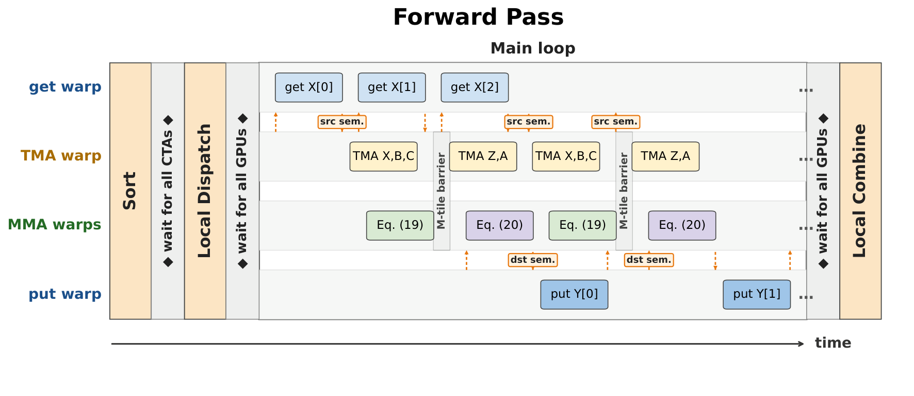
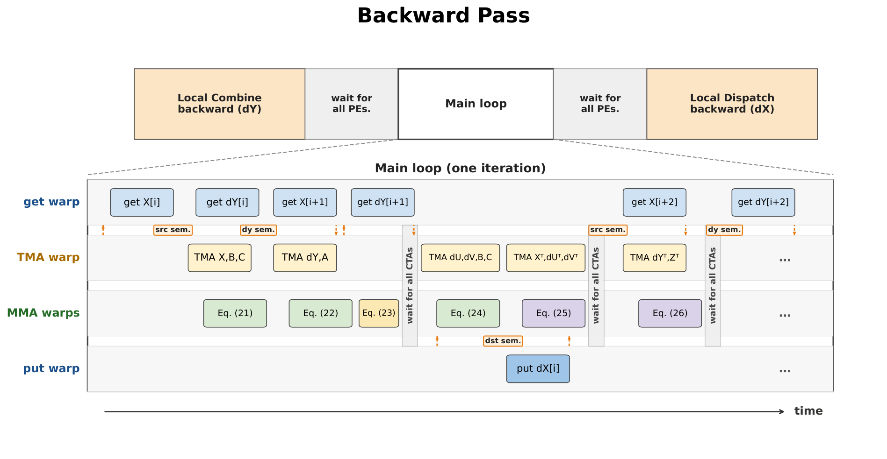
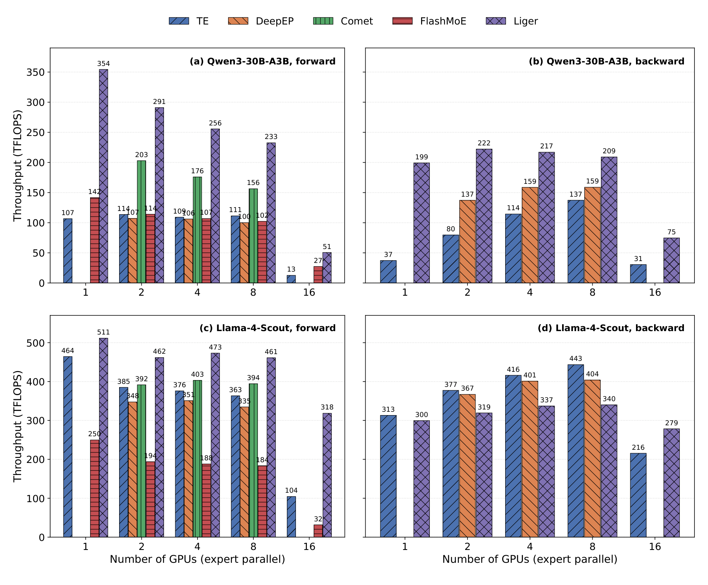
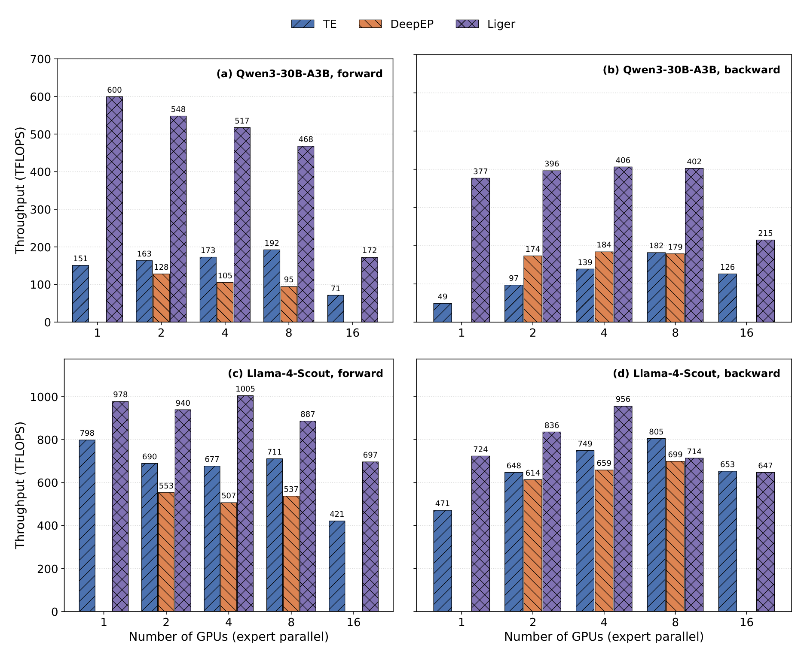
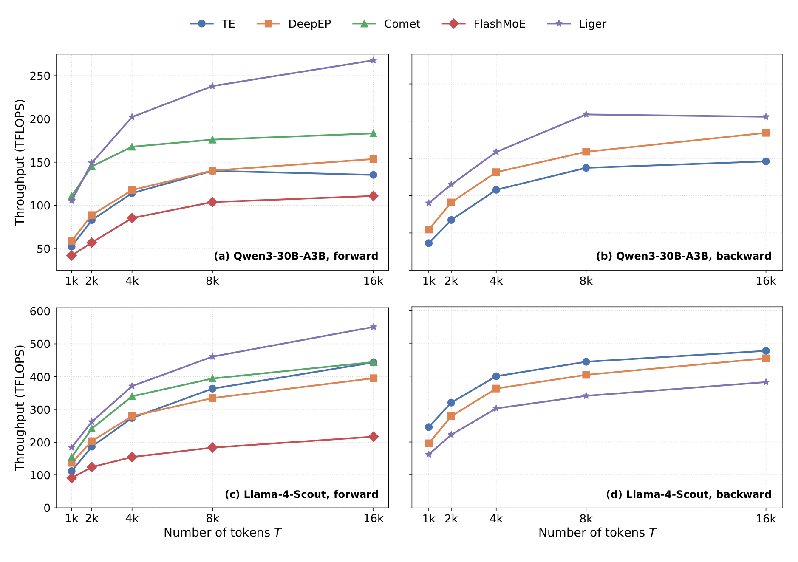
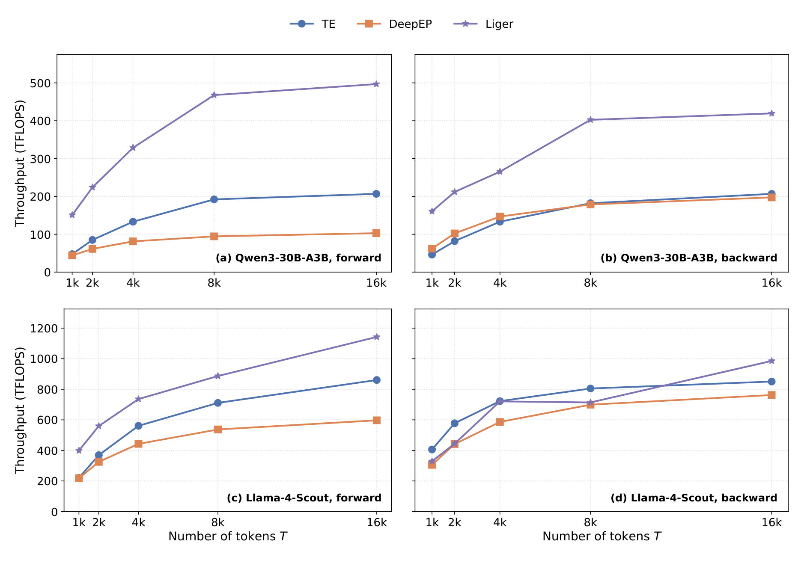
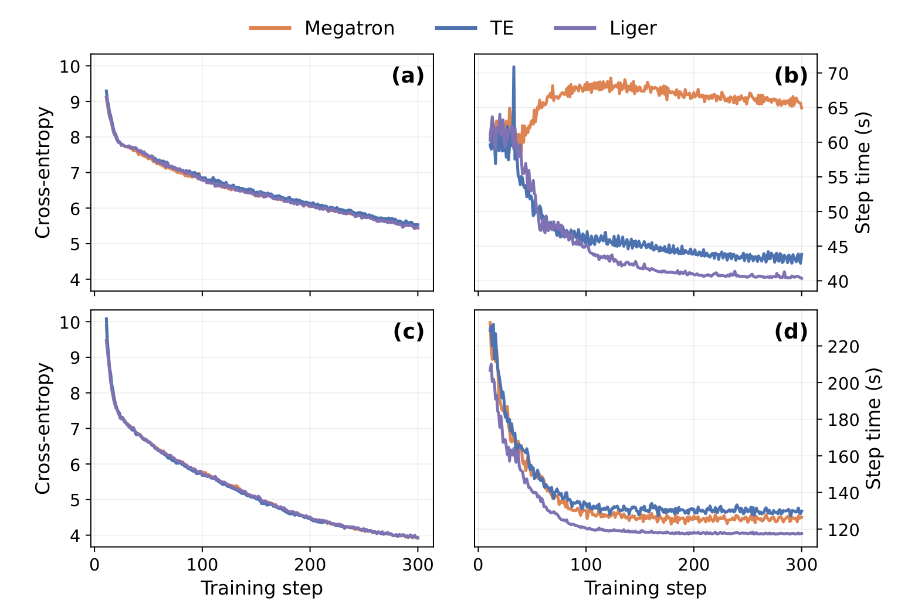

# LigerCute — native CUTLASS + NVSHMEM kernels

## Overview

`liger_cute_kernels` is the native CUTLASS + NVSHMEM kernel package for Liger.
It currently provides expert-parallel MoE and tensor-parallel fused scaled
linear cross entropy, with a Torch-ABI-independent core exposed through TVM FFI.

LigerMoE provides persistent expert-parallel forward and backward kernels for
NVIDIA Hopper and Blackwell GPUs. Each participating CTA uses warp
specialization so communication and tensor-core computation make progress on
the same SM: dedicated warps move routed token tiles while the MMA warps execute
the expert MLP. One-sided NVSHMEM RDMA removes sender/receiver coordination, and
preallocated symmetric buffers are sized from the total routed-token capacity
rather than a fixed per-expert capacity. This keeps the execution compatible
with CUDA Graphs despite dynamic routing.

The tensor-parallel fused scaled linear cross-entropy implementation fuses the
classifier projection with per-token NLL and optional entropy. Local MAX/SUM
reductions run in the tensor-core epilogue through NVLS or DirectPeer, with a
sharded inter-host ring follow-up for multi-host execution.

## LigerMoE design

### Forward pass



The forward path sorts routed tokens and copies them to symmetric memory before
entering the persistent main loop. Within that loop, get, TMA, MMA, and put
warps pipeline remote reads, tensor-core work, and result delivery. Intra-host
traffic uses direct TMA access over NVLink or PCIe; inter-host traffic uses
NVSHMEM get/put operations. A final local combine applies the router weights
after every expert result has arrived.

### Backward pass



The backward path first produces routed expert-output gradients, then overlaps
remote `X`/`dY` movement with activation recomputation, input-gradient
calculation, and expert-weight gradients. TMA reduce stores accumulate weight
gradients across token-tile batches. The final local dispatch reduces the
routed `dX` contributions back to the original tokens.

## MoE performance

The current evaluation uses BF16 and the CUDA 12.9 environment. These are
benchmark snapshots rather than performance guarantees for every model or
system.

| Evaluation | Current result |
|---|---|
| Qwen3-30B-A3B, 8 H200 GPUs, 8,192 tokens/rank | **233 TFLOP/s forward** and **209 TFLOP/s backward**, respectively 49% and 31% above the strongest plotted baselines |
| Qwen3-30B-A3B, 8 B300 GPUs, 8,192 tokens/rank | **468 TFLOP/s forward** and **402 TFLOP/s backward** |
| Qwen3-30B-A3B training, 8 H200 GPUs | **44.936 s mean step time**, a **1.472x speedup** over the Megatron baseline |
| Qwen3.5-122B-A10B training, 16 B200 GPUs | **126.489 s mean step time**, a **1.070x speedup** over the Megatron baseline |

### Throughput across expert-parallel GPU counts



H200 throughput at 8,192 tokens per rank from 1 to 16 expert-parallel GPUs.
Top: Qwen3-30B-A3B (`D=2048`, `I=768`). Bottom: Llama-4-Scout (`D=5120`,
`I=8192`). Left: forward. Right: backward. DeepEP and Comet require multiple
GPUs, and FlashMoE is forward-only.



B300 throughput for the same model shapes and token count. Comet and FlashMoE
are omitted because they do not support Blackwell. The 16-GPU points span two
hosts.

### Throughput across token counts



H200 throughput from 1,024 to 16,384 tokens per rank on 8 GPUs. Longer token
sequences deepen the transport/compute pipeline and improve SM utilization.



B300 throughput over the same token range on 8 GPUs. The panels use
Qwen3-30B-A3B (`E=128`, `K=8`) and Llama-4-Scout (`E=16`, `K=1`).

### End-to-end training



OpenWebText pre-training with sequence length 8,192 for 300 steps. Panels (a)
and (b) show Qwen3-30B-A3B on 8 H200 GPUs (`EP=8`, global batch size 256);
panels (c) and (d) show Qwen3.5-122B-A10B on 16 B200 GPUs across two hosts
(`EP=16`, global batch size 512). Mean step-time statistics exclude the first
ten CUDA-Graph warm-up steps. The three backends retain effectively equivalent
loss convergence in both experiments.

## Fused linear scaled cross entropy

The native cores also provide
`fused_linear_scaled_cross_entropy_forward` and
`fused_linear_scaled_cross_entropy_backward`. The backward path uses a
three-stage cluster-2 dZ handoff followed by a four-stage combined dX+dW
cluster kernel. dX uses split-K=2 only for hidden size 2,048; hidden size 4,096
uses split-K=1. Direct-peer and hierarchical multi-host transports remain
available when the single-host NVLS path is not selected.

The `liger_cute_kernels.tvm_ffi` facade exposes configuration plus forward and
backward entry points. Both accept the NVSHMEM team configured for the same
tensor-parallel ranks and take inverse temperature.
Capacities for tokens, hidden size, local vocabulary, and reduction grouping
must be configured before capture or execution.

Hierarchical NVLS+remote execution supports uniformly partitioned multi-host
subgroups. Team ranks must be host-major: each host contributes the same
number of consecutive team-local ranks. Setup applies
`nvshmem_team_split_2d` to derive an NVLS-capable local row and a matching-rank
remote column. For example, world ranks `{0,4,8,12}` on two eight-GPU hosts
become local teams `{0,4}` / `{8,12}` and remote pairs `{0,8}` / `{4,12}`.

Tensor-parallel reduction transport is implemented in `liger_cute::detail`.
Host setup selects either the NVLS or DirectPeer local backend and passes only
that backend's compact device view to the kernel. Multi-host setup retains the
parent-relative local and remote teams until configuration reset. The ring
topology, epochs, packed online-softmax state merge, and node-local all-gather
are shared by SM90 and SM100. The inter-host ring is a warp-scoped
device function: one worker warp avoids block synchronization for fusion,
while standalone wrappers use eight worker warps. SM100 forward partitions
the local vocabulary into configurable N256 waves (64 tiles by default),
keeps four source slots, and runs
the matching-rank host ring plus final state accumulation in warp 1 of one
stable CTA while later waves continue through TMA, UMMA, and the epilogue.
After the last wave, warp 1 performs the node-local NVLS all-gather and writes
NLL/LSE/entropy. SM90 forward retains the separately launched finalizer.
Backward uses the same ring between its local reduce-scatter and local
all-gather/scatter stages.

SM100 remote kernels synchronize on the configured parent TP team, then use a
cooperative clustered CUDA launch. They do not require the TP team to equal
`NVSHMEM_TEAM_WORLD`, so disjoint TP groups can execute independently.

On SM100 the backward is a single persistent 384-thread, cluster-2 kernel with
a device-side token-wave loop: dZ, dX, dW and the wave schedule are fused into
one launch. Warp 2 owns every TMA producer, warp 3 every UMMA issue, and warps
4-11 the epilogues and TMEM loads. Warp 4 takes a single `Allocator2Sm` TMEM
allocation, sized by the max over phases, that dZ, dX and dW reuse; the three
operand arenas form a phase-serial union while pipelines, mbarriers and the
TMEM handle live outside it. dW wave 0 stores and later waves TMA-reduce-add,
exactly like SM90. Every compute-side named barrier excludes warps 0 and 1, and
a full-grid software barrier is taken only where dZ workspace publication and
reuse require it, under a strict full-residency launch invariant.

The dX communication runs a three-stage chunk pipeline. A *chunk* is one token
wave's complete dX: every CTA of the grid contributes a disjoint set of
M128xN256 tiles into one packed shard region, so a chunk is exactly one
contiguous inter-host message.

* **Stage R — tile granular.** Warp 0 NVLS reduce-scatters each tile the dX
  epilogue publishes and releases its staging slot immediately; it never waits
  for the rest of the chunk.
* **Stage P — chunk granular.** After its last tile of chunk `k`, every CTA's
  warp 0 bumps a monotone completion counter. CTA 0's warp 1 launches the
  inter-host transfer only once the whole chunk is locally reduced. When the
  peer shard arrives, warp 1 from every resident CTA merges a global-strided
  section into the packed shard and contributes one HBM atomic arrival. CTA 0
  acknowledges the ring and publishes completion after all `grid_ctas`
  arrivals.
* **Stage F — chunk granular, deferred by one chunk.** Warp 0 finalizes chunk
  `k` (node-local NVLS all-gather plus the BF16 scatter into `grad_input`) at
  the top of chunk `k+1`, so it overlaps chunk `k+1`'s dZ GEMM instead of
  gating it. The last chunk is drained after the wave loop.

The communication pipeline therefore spans both the same chunk's dW GEMM and
the next chunk's dZ GEMM:

```
compute   | dX(k) | dW(k)              | dZ(k+1)            | dX(k+1) | dW(k+1)
warp 0    | R(k) tile by tile          | F(k)               | R(k+1) ...
warp 1s   |       | IB transfer + all-CTA warp-1 merge      | IB dX(k+1) ...>
```

dX(`k`) is finalized before its slots could be reused, not before compute
advances: the end-of-wave grid barrier protects the dZ workspace only, the
tile-granular staging ring is released in stage R, and the packed shard plus
the all-gather destination are addressed by absolute chunk index, so the two
live chunks always own disjoint storage. SM90 backward retains its two
separately launched wave kernels and its standalone finalizer.

The wave width can be selected at build time with
`-DLIGER_CUTE_FSLCE_SM100_WAVE_N_TILES=16|32|64|128`.
The ring publishes each whole shard and its ready epoch with one blocking
`nvshmemx_qp_float_put_signal_warp` on `NVSHMEMX_QP_DEFAULT`; it contains no
`nvshmem_quiet`, `nvshmem_fence`, or `put_block` calls. Two-host execution
alternates ready/inbox slots by wave sequence and needs no consumed signals.
Larger host rings retain consumed acknowledgements and pipeline their final
waits across waves by default.

On B300 two-host runs, pin one PE to each GPU-local HCA:

```bash
export NVSHMEM_REMOTE_TRANSPORT=ibrc
export NVSHMEM_IB_ENABLE_IBGDA=1
export NVSHMEM_ENABLE_NIC_PE_MAPPING=1
unset NVSHMEM_HCA_LIST
export NVSHMEM_HCA_PE_MAPPING='mlx5_0:1:1,mlx5_2:1:1,mlx5_3:1:1,mlx5_4:1:1,mlx5_5:1:1,mlx5_6:1:1,mlx5_8:1:1,mlx5_9:1:1'
```

With `NVSHMEM_DEBUG=INFO`, initialization should report
`Successfully initialized the transport: IBGDA. It will be used for
device-side APIs over IB.`

For transport attribution, the SM100 remote stage can instead use matching-rank
warp MAX/SUM collectives with
`-DLIGER_CUTE_FSLCE_SM100_USE_WARP_TEAM_COLLECTIVES=ON`. This two-pass mode is
an ablation; the QP combined put-signal ring remains the default.

The distributed forward benchmark keeps the production Verl-derived fallback
selectable and reports full-forward latency, effective global TFLOP/s, and
maximum per-rank CUDA memory:

```bash
torchrun --standalone --nproc_per_node=8 \
  benchmark/scripts/benchmark_fused_scaled_linear_cross_entropy_tp.py \
  --provider native

torchrun --standalone --nproc_per_node=8 \
  benchmark/scripts/benchmark_fused_scaled_linear_cross_entropy_tp.py \
  --provider verl-fallback
```

## Package architecture

The release wheel packages one core for Hopper and one for the common
Blackwell-family ISA. The Python facade selects the matching core for the
active GPU:

| Artifact | Sources | Links | Boundary | Built |
|---|---|---|---|---|
| `libliger_cute_kernels_sm90a.so` | `csrc/core` + `liger_cute_kernels/tvm_ffi_bindings.cpp` | CUTLASS + NVSHMEM + CUDA + TVM FFI — **no torch** | flat `extern "C"` (`liger_cute.h`) and TVM FFI exports (`__tvm_ffi_*`) | once per release |
| `libliger_cute_kernels_sm100f.so` | same | same | same | once per release |

The core's public ABI is `extern "C"` only (no `std::`/torch types cross it),
symbols are hidden except `liger_cute_*` and `__tvm_ffi_*`, and libstdc++/libgcc
are linked statically. That makes the core **ABI-agnostic**: the Python binding
is TVM FFI/DLPack based and is not tied to a specific torch wheel or runtime JIT
compile.

## Two separate wheels

The top-level **`liger_kernel` wheel is pure Python/Triton** and does **not**
build or contain any of this native code. The native libraries ship as a
separate **`liger-cute-kernels` distribution with the same public version**.
It installs its own standalone top-level package **`liger_cute_kernels`**.
`liger_kernel.ops.cute` imports
`liger_cute_kernels.tvm_ffi` at runtime. Intended order:

1. Install the top-level `liger_kernel` wheel (pure Python).
2. *Optionally* install the matching native wheel (package `liger_cute_kernels`)
   for the local CUDA + torch environment.

The native wheel is built by this module's `setup.py` (see **Building the
native wheel** below). Selecting/installing the right wheel automatically for
the local CUDA + torch environment is a separate follow-up.

## Layout

`liger_cute_kernels/` is a **standalone module at the repo root** holding
everything needed to build the native libraries. Only `__init__.py` (the
in-liger entry point) lives separately, under `src/liger_kernel/ops/cute/`.

```
liger_cute_kernels/             # ← standalone native build module (repo root)
├── README.md
├── assets/                     # README benchmark figures
├── setup.py                    # builds the native wheel (package liger_cute_kernels)
├── pyproject.toml
├── cute_build.py               # build_core() helper + native wheel build extension
├── liger_cute_kernels/         # native package source
│   ├── __init__.py             # (.so are added here at build time)
│   ├── tvm_ffi.py              # Python facade over the TVM FFI exports
│   └── tvm_ffi_bindings.cpp    # TVM FFI C++ exports compiled into the core
├── test/                       # native package unit tests
│   └── test_moe_bindings.py
├── CMakeLists.txt              # core with TVM FFI exports
├── cmake/
│   ├── FindNVSHMEM.cmake
│   └── FindCUTLASS.cmake        # locates main + tools/util/include
└── csrc/
    ├── core/                   # → libliger_cute_kernels.so (torch-free)
    │   ├── include/liger_cute/
    │   │   ├── {liger_cute.h, export.h}     # flat extern "C" ABI (C-parseable)
    │   │   ├── {check.h, moe.h}             # core control/config surface
    │   │   └── detail/symmetric_memory.h    # core-internal (nvshmem+STL); not ABI
    │   ├── src/                 # *.{cu,cpp} compiled INTO the core …
    │   │   ├── moe/             # expert-parallel MoE kernels
    │   │   │   └── tune/        # standalone offline autotuner — NOT a core source
    │   │   └── fused_scaled_linear_cross_entropy/
    │   │                        # tensor-parallel fused loss kernels
    │   └── liger_cute.version   # exports only liger_cute_* and __tvm_ffi_*

src/liger_kernel/ops/cute/
└── __init__.py                 # runtime entry point: liger_kernel.ops.cute
                                #   (loads liger_cute_kernels.tvm_ffi if installed)
```

## Prerequisites

- **CUDA toolkit** with `nvcc` and either SM 9.0a (Hopper / `sm_90a`) or
  Blackwell family (`sm_100f`) support. The family target covers both B200
  (`sm_100`) and B300 (`sm_103`) while enabling TCGEN05 UMMA and TMEM.
- **NVSHMEM** install (host `.so`, device `.a`, headers). Two layouts are
  supported:
  - Native/system install: point `NVSHMEM_HOME` at it, or use the default
    `/usr/local/nvshmem`.
  - PyPI install: install `nvidia-nvshmem-cu12==3.6.5`. The Python wheel
    builder and `build_core()` auto-detect that package layout and create
    unversioned compatibility symlinks for CMake when needed. For direct CMake
    invocation, pass the package root as `-DNVSHMEM_HOME=...`; the find module
    accepts its versioned `libnvshmem_host.so.3`.
- **CUTLASS** headers (4.x) — point `CUTLASS_HOME` at the repo root (so that
  `$CUTLASS_HOME/include/cutlass/cutlass.h` and
  `$CUTLASS_HOME/tools/util/include` exist). *Not needed when linking a prebuilt
  core.*
- **CMake ≥ 3.24**; **Ninja** recommended.
- **apache-tvm-ffi** at build and runtime. CMake uses `tvm-ffi-config` to
  compile the TVM FFI exports, and `liger_cute_kernels/tvm_ffi.py` uses the
  Python `tvm_ffi` loader at runtime:

  ```bash
  python -m pip install apache-tvm-ffi
  ```

Build commands below are run from the **repository root**; the CMake project is
the `liger_cute_kernels/` module directory.

## Building

### 1. Core only (torch-free)

No torch required. This is the expensive CUTLASS compile, done once.

```bash
cmake -S liger_cute_kernels -B build/core \
      -DLIGER_CUTE_BUILD_BINDINGS=OFF \
      -DCMAKE_BUILD_TYPE=Release -GNinja
cmake --build build/core --target liger_cute_kernels -j
# -> build/core/csrc/core/libliger_cute_kernels.so
```

To also build the opt-in whole-program SM90 MoE module:

```bash
cmake -S liger_cute_kernels -B build/core \
      -DLIGER_CUTE_BUILD_BINDINGS=OFF \
      -DLIGER_CUTE_ENABLE_SM90_NONRDC_MOE=ON \
      -DCMAKE_BUILD_TYPE=Release -GNinja
cmake --build build/core --target liger_cute_kernels -j
```

One cubin is placed beside `libliger_cute_kernels.so`. It contains separate
compile-time local and IB-capable kernel instantiations. At runtime, set
`LIGER_MOE_SM90_NONRDC=1` before `moe_configure_symmetric`. The core loads the
module into the current CUDA context, registers it with
`nvshmemx_cumodule_init`, and uses it for SM90 forward and backward launches.
Each launch translates the configured EP team's members into
`NVSHMEMX_TEAM_NODE` on the host. If every member belongs to the node team, the
local specialization is selected; otherwise the IB-capable specialization is
selected. The local specialization compiles out IB transport and device-side
`nvshmem_ptr` probing.
The initial module contains the tuned Mixtral-8x7B `T=8192` forward and
backward specializations; other shapes continue through the ordinary RDC
kernels. Add `-DLIGER_CUTE_SM90_NONRDC_ALL_CONFIGS=ON` for the complete tuned
menu and 1/2/4/8/16-PE benchmark coverage, including the cross-host IB path.
For development artifacts in a different directory, set
`LIGER_MOE_SM90_NONRDC_CUBIN`.

Build for Blackwell by overriding the CUDA architecture:

```bash
cmake -S liger_cute_kernels -B build/core-sm100f \
      -DLIGER_CUTE_BUILD_BINDINGS=OFF \
      -DLIGER_CUTE_CUDA_ARCH=100f \
      -DCMAKE_BUILD_TYPE=Release -GNinja
cmake --build build/core-sm100f --target liger_cute_kernels -j
```

Use architecture-specific `100a` or `103a` targets only when a kernel requires
features outside the common Blackwell-family ISA.

Or from Python (with `liger_cute_kernels/` on `sys.path`):

```python
from cute_build import build_core
build_core("build/core")   # stages one core and an optional SM90 cubin
```

`build_core()` auto-detects both native and PyPI NVSHMEM installations. Direct
CMake builds against the PyPI package must pass its root explicitly:

```bash
NVSHMEM_PYPI_HOME="$(python -c \
  'import importlib.util; s=importlib.util.find_spec("nvidia.nvshmem"); print(next(iter(s.submodule_search_locations)))')"
cmake -S liger_cute_kernels -B build/core \
      -DNVSHMEM_HOME="${NVSHMEM_PYPI_HOME}" \
      -DLIGER_CUTE_BUILD_BINDINGS=OFF
```

### 2. Core + TVM FFI exports from source (single local build)

```bash
cmake -S liger_cute_kernels -B build/all \
      -DLIGER_CUTE_BUILD_BINDINGS=OFF \
      -DCMAKE_BUILD_TYPE=Release -GNinja
cmake --build build/all --target liger_cute_kernels -j
```

### 3. Wheel build against a prebuilt core (reuse across builds)

Reuses an existing `libliger_cute_kernels.so` instead of recompiling the core.
CUTLASS is not even searched here. This mode is useful when packaging a core
that was already compiled in a separate step.

```bash
cmake -S liger_cute_kernels -B build/bind \
      -DLIGER_CUTE_BUILD_BINDINGS=OFF \
      -DLIGER_CUTE_CORE_IMPORTED_DIR=/abs/path/to/dir-with-core \
      -DCMAKE_BUILD_TYPE=Release -GNinja
cmake --build build/bind --target liger_cute_kernels -j
```

### 4. Offline autotuner (`tune_moe_fwd_bwd`) — optional, not in the wheel

`csrc/core/src/moe/tune/` holds a **standalone** executable that regenerates the
tuned-config tables (`csrc/core/src/moe/moe_fwd_bwd_tuning_configs_{single,multi}.cuh`)
the runtime auto-dispatcher searches. It is **not** built by the core/bindings
targets above or shipped in the wheel: it has its **own** CMake project, and it
links the templated kernel launchers that the core `.so` deliberately hides
(visibility hidden + version script), so it recompiles `moe.cu` / `moe_bwd.cu`
itself at default visibility against **torch**. That makes it a full CuTe compile
(~45 min) — build it on demand, only when retuning.

Needs `CUTLASS_HOME`, `NVSHMEM_HOME`, and an importable **torch** (same as the
bindings). Build it as its own project (note `-S` points at the `tune/` dir, not
the repo root):

```bash
cmake -S liger_cute_kernels/csrc/core/src/moe/tune -B build/tuner \
      -DCMAKE_BUILD_TYPE=Release -GNinja
cmake --build build/tuner -j
# -> build/tuner/tune_moe_fwd_bwd
```

Run one rank per GPU under a PMI bootstrap; point the output env var at the table
you are regenerating (without it the `.cuh` is written to the current directory):

```bash
LIGER_MOE_FWDBWD_TUNED_OUTPUT=/abs/path/to/moe_fwd_bwd_tuning_configs_multi_sm90.cuh \
    srun --mpi=pmi2 --ntasks=8 ./build/tuner/tune_moe_fwd_bwd   # multi-PE class
# single-PE class (all experts local): --ntasks=1 + the _single_sm90.cuh output path
```

Cross-rank diagnostics can deliberately vary otherwise independent rank-local
work: `MOE_FWDBWD_TUNE_TOKEN_SKEW=N` subtracts `rank*N` tokens,
`MOE_FWDBWD_TUNE_HETEROGENEOUS_SEED=1` cycles forward templates by rank, and
`MOE_FWDBWD_TUNE_DETERMINISTIC_SEED=1` forces the first candidate instead of
each rank's measured winner. Combine them with `MOE_FWDBWD_TUNE_VERBOSE=1` to
log the selected templates. `MOE_FWDBWD_TUNE_COOLDOWN_MS=N` sleeps outside
timed CUDA events, and `MOE_FWDBWD_TUNE_REVERSE_CANDIDATES=1` reverses sweep
order to expose thermal/order bias. `MOE_FWDBWD_TUNE_FWD_ONLY=1` skips the
backward sweep for forward-only diagnostics and therefore does not produce a
complete tuned row. `MOE_FWDBWD_TUNE_T`, `_D`, `_I`, `_E`, and `_FAMILY` can
pin an exact named-shape run; `MOE_FWDBWD_TUNE_K=N` overrides generic-sweep
top-k. Routed inputs are deterministic by default;
`MOE_FWDBWD_TUNE_INPUT_SEED=N` selects a different reproducible input and
router distribution. `MOE_FWDBWD_TUNE_EXACT=1` runs exactly one arbitrary
shape and requires the `T`, `D`, `I`, and local-`E` overrides (plus optional
`K`).

## Building the native wheel

This module's `setup.py` packages the native libraries into the independent
**`liger-cute-kernels`** distribution. The release wheel contains both
`libliger_cute_kernels_sm90a.so` and
`libliger_cute_kernels_sm100f.so`; NVSHMEM is installed independently through
the pinned `nvidia-nvshmem-cu12` dependency. Build against the local
CUDA/NVSHMEM environment (no build isolation), from this module directory:

```bash
cd liger_cute_kernels
python -m pip install apache-tvm-ffi nvidia-nvshmem-cu12==3.6.5
LIGER_CUTE_CUDA_ARCHS=90a,100f \
    pip wheel . --no-deps --no-build-isolation -w dist
# Release build:
# -> dist/liger_cute_kernels-<liger-version>-py3-none-manylinux_2_35_x86_64.whl
```

For a native NVSHMEM install:

```bash
NVSHMEM_HOME=/usr/local/nvshmem \
    LIGER_CUTE_ENABLE_SM90_NONRDC_MOE=1 \
    pip wheel . --no-deps --no-build-isolation -w dist
```

For the PyPI NVSHMEM layout:

```bash
pip install nvidia-nvshmem-cu12==3.6.5
pip wheel . --no-deps --no-build-isolation -w dist
```

The wheel reads its version from the repository's root `pyproject.toml`, so
`liger-kernel` and `liger-cute-kernels` are released with the same version. To
reuse architecture cores built in separate jobs, place them under
`<core-dir>/90a/libliger_cute_kernels.so` and
`<core-dir>/100f/libliger_cute_kernels.so`, then point packaging at the root:

```bash
LIGER_CUTE_CUDA_ARCHS=90a,100f \
LIGER_CUTE_CORE_DIR=/abs/dir-with-core \
    pip wheel . --no-deps --no-build-isolation -w dist
```

Install order at the consumer side: the `liger_kernel` wheel first, then
optionally the matching native wheel.

The wheel workflow also runs directly on every push to `main` as a nightly
integration build. These runs build, package, validate, and retain the wheel as
a workflow artifact, but the PyPI upload job runs only for a published GitHub
release.

## Source-tree Python verification

The Python facade imports the external `tvm_ffi` package, preloads NVSHMEM from
`nvidia/nvshmem/lib`, and selects the packaged SM90a or SM100f core from the
active GPU capability. In a source checkout, `pytest` skips the Python tests
until the required pieces exist.

```bash
cd liger_cute_kernels
python -m pip install apache-tvm-ffi

cmake -S . -B build/core \
      -DLIGER_CUTE_BUILD_BINDINGS=OFF \
      -DCMAKE_BUILD_TYPE=Release -GNinja
cmake --build build/core --target liger_cute_kernels -j

cp build/core/csrc/core/libliger_cute_kernels.so \
    liger_cute_kernels/libliger_cute_kernels_sm90a.so

python - <<'PY'
import liger_cute_kernels.tvm_ffi as tvm_ffi
print(tvm_ffi.is_available())
print(tvm_ffi.uniqueid_nbytes())
PY

python -m pytest -q test
```

Alternatively, install the built wheel and its dependencies.

## CMake options

| Option | Default | Effect |
|---|---|---|
| `LIGER_CUTE_BUILD_BINDINGS` | `OFF` | Deprecated compatibility option. Leave OFF; tensor APIs are exposed through TVM FFI only. |
| `LIGER_CUTE_CORE_IMPORTED_DIR` | *(empty)* | Dir holding a prebuilt `libliger_cute_kernels.so`. When set, the core is linked as an imported library (not compiled) and CUTLASS is not required. |
| `LIGER_CUTE_CUDA_ARCH` | `90a` | CUDA target architecture. Use `100f` for one B200/B300 Blackwell-family build. |
| `LIGER_CUTE_CUDA_ARCHS` | *(empty)* | Comma-separated architecture cores to package in one wheel, for example `90a,100f`. Mutually exclusive with `LIGER_CUTE_CUDA_ARCH`. |
| `LIGER_CUTE_VERSION` | root package version | Explicit wheel-version override; release builds validate it against the root `liger-kernel` version. |
| `LIGER_CUTE_STRIP_NATIVE` | `0` | Set to `1` to strip packaged core libraries. |
| `LIGER_CUTE_FSLCE_SM100_STAGES` | `5` | SM100 forward TMA mainloop stages. |
| `LIGER_CUTE_FSLCE_SM100_WAVE_N_TILES` | `64` | SM100 forward communication wave width in N256 tiles. |
| `LIGER_CUTE_FSLCE_SM100_BACKWARD_STAGES` | `5` | SM100 fused backward dZ TMA mainloop stages. |
| `LIGER_CUTE_FSLCE_SM100_BACKWARD_DIAGNOSTIC_CHUNK_PIPELINE` | `OFF` | Diagnostic only: force the chunk-granular deferred dX schedule on a single host so the state machine can be validated without an inter-host ring. |
| `LIGER_CUTE_BUILD_TESTS` | `OFF` | Build the C++ gtest tests. |
| `LIGER_CUTE_TESTS_ONLY` | `OFF` | Build only tests; skips NVSHMEM/TVM FFI/core packaging. |
| `LIGER_CUTE_STATIC_LIBSTDCXX` | `ON` | Statically link libstdc++/libgcc into the core so its internal C++ ABI is invisible to consumers. |
| `NVSHMEM_HOME` | `/usr/local/nvshmem` | NVSHMEM install root (also read from the env var). |
| `CUTLASS_HOME` | *(env)* | CUTLASS repo root (read from the env var; only needed to compile the core). |

Standard CMake flags also apply: `-DCMAKE_BUILD_TYPE=Release`, `-GNinja`,
`-DPython_EXECUTABLE=...`.

CUDA architecture defaults to `sm_90a` (Hopper, with WGMMA/TMA/multicast) and
is configurable with `-DLIGER_CUTE_CUDA_ARCH=100f` for B200 and B300.

## Environment variables

| Variable | Used by | Effect |
|---|---|---|
| `NVSHMEM_HOME` | CMake / `cute_build` | NVSHMEM install root (default `/usr/local/nvshmem`). |
| `CUTLASS_HOME` | CMake | CUTLASS repo root (core compile only). |
| `LIGER_CUTE_CUDA_ARCH` | CMake / `cute_build` | CUDA target architecture; use `100f` for a shared Blackwell-family build. |
| `LIGER_CUTE_CUDA_ARCHS` | `cute_build` | Comma-separated architecture cores to package in one wheel, for example `90a,100f`. |
| `LIGER_CUTE_CORE_DIR` | `setup.py` | Dir with a prebuilt core. Set → link it (no core recompile); unset → build the core from source. |
| `LIGER_CUTE_BUILD_JOBS` | `cute_build` | Maximum parallel native build jobs. The release workflow uses `4`. |
| `LIGER_CUTE_VERSION` | `setup.py` | Override the root `liger-kernel` version used by the native wheel. |
| `LIGER_CUTE_STRIP_NATIVE` | `cute_build` | Set to `1` to strip packaged native libraries. |
| `LIGER_CUTE_WHEEL_PLATFORM_TAG` | `setup.py` | Override the native wheel platform tag. The pinned release container uses `manylinux_2_35_x86_64`. |

## Verifying a core build

```bash
SO=build/core/csrc/core/libliger_cute_kernels.so
nm -D --defined-only "$SO" | grep ' T '      # exports: only liger_cute_*
readelf -d "$SO" | grep NEEDED               # no libtorch, no direct libstdc++
```

The core should export only `liger_cute_*` symbols and have no direct
`libstdc++`/`libtorch` `NEEDED` entries (a transitive `libstdc++` via
`libnvshmem_host` is expected and harmless).

## Runtime notes

- `tvm_ffi.py` selects `libliger_cute_kernels_sm90a.so` for H100/H200 and
  `libliger_cute_kernels_sm100f.so` for the Blackwell family, then loads it with
  `tvm_ffi.load_module`.
- NVSHMEM is not copied into the LCK wheel. The loader preloads
  `libnvshmem_host.so.3` from the separately installed
  `nvidia-nvshmem-cu12==3.6.5` package.
